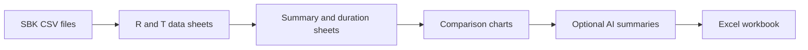
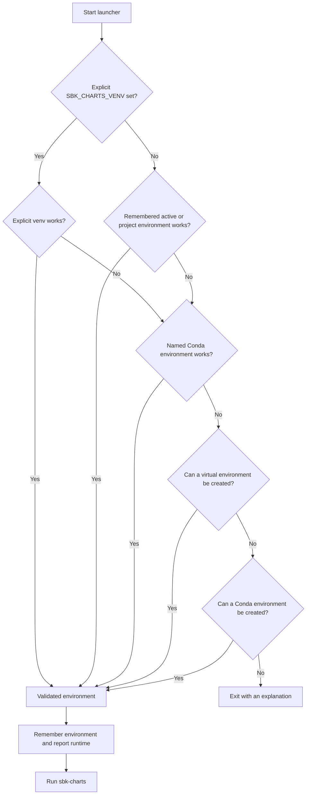

<!--
Copyright (c) KMG. All Rights Reserved.
Licensed under the Apache License, Version 2.0.
-->

# sbk-charts

sbk-charts turns one or more [SBK](https://github.com/kmgowda/SBK) benchmark CSV files into a readable Excel workbook. The workbook keeps the original measurements, separates interval data from totals, and adds formatted charts for throughput, latency, percentiles, data volume, and timeout events. It can also ask a selected AI backend to write plain-English performance summaries and answer questions about the loaded results.

The current application version is **4.26.8.1** and it requires Python 3.10 or newer when run from source.

## What it produces

The workbook starts with an `SBK` cover sheet containing the project logo. For each input CSV, sbk-charts then creates two data sheets:

- `R1`, `R2`, and so on contain regular interval rows, where the CSV `Type` value is not `Total`.
- `T1`, `T2`, and so on contain total rows, where `Type` is `Total`.

It then adds a Summary sheet, a benchmark-duration sheet, and chart sheets. Broad comparisons appear first, followed by total summaries and then fine-grained latency and percentile views.



Important features include:

- single-run and multi-run workbooks;
- rich Excel tables with readable fonts, widths, colors, and frozen headers;
- throughput comparisons in MB/sec and records/sec;
- write/read throughput and timeout comparisons;
- minimum, average, maximum, and percentile latency charts;
- percentile-count histograms;
- a Summary sheet with version, report date/time, drivers, actions, and latency unit, plus a Durations sheet with each run's start, end, and elapsed time;
- optional AI analysis through Anthropic, Gemini, Hugging Face, LM Studio, Ollama, or an in-process PyTorch model;
- an interactive AI chat mode grounded in the workbook data;
- self-bootstrapping launchers for Linux, macOS, and Windows;
- native portable archives that do not require Python on the destination machine.

## Quick start

Clone the repository and run the launcher from the project root.

Linux or macOS:

```bash
./sbk-charts -i samples/charts/sbk-file-read.csv -o out.xlsx
```

Windows PowerShell:

```powershell
.\sbk-charts.ps1 -i samples\charts\sbk-file-read.csv -o out.xlsx
```

Windows Command Prompt:

```bat
sbk-charts.bat -i samples\charts\sbk-file-read.csv -o out.xlsx
```

On first use, the source launcher finds Python 3.10 or newer, prepares an environment, installs the project, and starts the application. Later runs prefer the last environment that passed runtime and dependency validation. The launcher prints the operating system, exact Python executable, Python version, and whether it selected a virtual environment or Conda.

The first bootstrap needs access to the Python package index. If Python virtual-environment setup fails, for example because a platform-specific PyTorch wheel is unavailable, the launcher tries Conda when Conda is installed.

## Command-line syntax

```text
sbk-charts -i <csv[,csv...]> [-o <workbook.xlsx>] \
    [-secs <seconds>] [-nothreads] [-chat] [ai-backend] [backend-options]
```

Common options:

| Option | Meaning |
|---|---|
| `-i`, `--ifiles` | Required comma-separated input CSV paths. Do not add spaces around the commas. |
| `-o`, `--ofile` | Output workbook path. Default: `out.xlsx`. |
| `-secs`, `--seconds` | Total AI analysis time budget in seconds. Default: `120`. |
| `-nothreads` | Run the four AI analyses one at a time. Useful for local or GPU models. |
| `-chat` | Start interactive chat after workbook analysis. Requires an AI backend. |
| `-h`, `--help` | Show general help. Put `-h` after a backend name for backend-specific help. |

Global options must come before the AI backend name. Backend-specific options come after it.

```bash
./sbk-charts -i input.csv -o report.xlsx -secs 300 -nothreads ollama --ollama-model llama3.1
```

## Everyday examples

Create charts from one run:

```bash
./sbk-charts -i samples/charts/sbk-file-read.csv -o file-read.xlsx
```

Compare two runs in one workbook:

```bash
./sbk-charts \
  -i samples/charts/sbk-file-read.csv,samples/charts/sbk-rocksdb-read.csv \
  -o file-vs-rocksdb.xlsx
```

Use the default output name:

```bash
./sbk-charts -i samples/charts/sbk-file-read.csv
# Creates out.xlsx
```

Show the available AI backends:

```bash
./sbk-charts -h
```

Show options for one backend. The required input is only present so the top-level parser can run:

```bash
./sbk-charts -i samples/charts/sbk-file-read.csv gemini -h
```

## AI analysis

Selecting an AI backend adds four narratives to the Summary sheet:

1. throughput analysis;
2. latency analysis;
3. total transferred MB analysis;
4. percentile-histogram analysis.

AI output can be incomplete or wrong. Treat it as an explanation aid and verify important conclusions against the workbook charts and source data.

| Backend | Runs where | Credential or service | Default model |
|---|---|---|---|
| `anthropic` | Cloud | `ANTHROPIC_API_KEY` | `anthropic-sonnet-4-20250514` |
| `gemini` | Cloud | `GEMINI_API_KEY` | `gemini-2.5-flash` |
| `huggingface` | Cloud | `HUGGINGFACE_API_TOKEN` | `meta-llama/Llama-3.1-8B-Instruct` |
| `lmstudio` | Local server | Running LM Studio | Server-selected model |
| `ollama` | Local server | Running Ollama | `llama3.1` |
| `pytorchllm` | Local process | PyTorch and model files | `openai/gpt-oss-20b` |
| `noai` | Local placeholder | None | No model; writes placeholder results |

The model names above are code defaults, not a promise that a provider still offers a model. Use the backend-specific model option when needed.

### Gemini example

```bash
export GEMINI_API_KEY="your-key"
./sbk-charts -i input.csv -o report.xlsx \
  gemini --gemini-model gemini-2.5-flash
```

### Anthropic example

```bash
export ANTHROPIC_API_KEY="your-key"
./sbk-charts -i input.csv -o report.xlsx \
  anthropic --anthropic-max-tokens 4096
```

### Hugging Face example

```bash
export HUGGINGFACE_API_TOKEN="your-token"
./sbk-charts -i input.csv -o report.xlsx \
  huggingface --model_id meta-llama/Llama-3.1-8B-Instruct
```

### Ollama example

Start Ollama and download a model first:

```bash
ollama pull llama3.1
ollama serve
```

Then run:

```bash
./sbk-charts -i input.csv -o report.xlsx \
  ollama --ollama-model llama3.1
```

### LM Studio example

Start the LM Studio server and load a model, then run:

```bash
./sbk-charts -i input.csv -o report.xlsx -nothreads \
  lmstudio --url http://localhost:1234/api/v0
```

### PyTorch example

The default model is very large. Choose a model that fits your machine and prefer sequential analysis on a single GPU:

```bash
./sbk-charts -i input.csv -o report.xlsx -secs 1800 -nothreads \
  pytorchllm --pt-model <hugging-face-model-id> --pt-device cpu
```

See [AI backend documentation](src/custom_ai/README.md) for every backend flag and setup note.

## Interactive chat

Chat mode starts after charts and the four AI analyses are complete. It loads benchmark statistics into the built-in in-memory retrieval layer and adds relevant measurements to each question sent to the selected backend.

```bash
./sbk-charts -i input.csv -o report.xlsx -chat ollama
```

Type a question, then press Enter on an empty line to submit it. Press Control-D to leave chat. Example questions:

- Which storage system has the highest records per second?
- Compare average and p99 latency across the runs.
- Which run has the most timeout events?
- Is higher throughput associated with worse tail latency here?

The default retrieval implementation is local and does not require ChromaDB. It helps ground the prompt, but it does not guarantee a correct answer.

## How the source launcher selects an environment

The Linux/macOS and Windows launchers read shared settings from [`sbk-charts.ini`](sbk-charts.ini).



Useful overrides:

| Variable | Purpose |
|---|---|
| `SBK_CHARTS_VENV` | Use a specific virtual-environment directory. |
| `SBK_CHARTS_CONDA_ENV` | Use a different Conda environment name. |
| `SBK_CHARTS_STATE_FILE` | Store the last-validated-environment record elsewhere. |

The default state file is `.sbk-charts-runtime` in the project root. Delete that small file if you deliberately want the launcher to forget its last validated choice.

## Manual development setup

Use this when you want direct control instead of launcher-managed setup:

```bash
python3 -m venv venv-sbk-charts
source venv-sbk-charts/bin/activate
python -m pip install --upgrade pip
python -m pip install -e .
./sbk-charts -h
```

On Windows PowerShell, activate with:

```powershell
.\venv-sbk-charts\Scripts\Activate.ps1
python -m pip install --upgrade pip
python -m pip install -e .
```

Conda is also supported:

```bash
conda create -n sbk-charts python=3.12 -y
conda activate sbk-charts
python -m pip install -e .
```

Build the wheel and source distribution:

```bash
python -m build
```

## Portable distributions

Release automation can build self-contained archives for Linux x86-64, macOS Apple silicon, and Windows x86-64. These archives bundle Python and dependencies, so the destination machine does not need Python, pip, venv, or Conda.

Read [Portable distributions](docs/PORTABLE.md) for supported targets, checksum verification, execution, and local build instructions.

## Troubleshooting

### A backend is missing from help

Plugin discovery skips a backend when importing its Python module fails. Run:

```bash
# Activate the selected environment first, then use its Python executable.
python -c \
  "from src.ai.discover import discover_custom_ai_classes; print(discover_custom_ai_classes())"
```

The import message printed before the dictionary identifies the missing package or failing module.

### The launcher keeps selecting the wrong environment

Use `SBK_CHARTS_VENV` for a specific virtual environment, `SBK_CHARTS_CONDA_ENV` for a specific Conda name, or remove `.sbk-charts-runtime` to clear the remembered choice. A remembered environment is reused only while its Python and installed sbk-charts version remain valid.

### Chart generation stops after printing the time unit

All compared R sheets must use the same latency time unit. Compare runs with matching units or normalize the source data first.

### AI analysis times out

Increase the budget, use a faster model, or run sequentially for resource-heavy local models:

```bash
./sbk-charts -i input.csv -o report.xlsx -secs 600 -nothreads ollama
```

### PyTorch cannot be installed in a virtual environment

PyTorch wheels vary by Python version, operating system, and processor. The self-bootstrap launcher tries Conda after virtual-environment installation fails. You can also use a supported Python version explicitly through `SBK_CHARTS_VENV`, or use a portable build for your platform.

## Documentation map

| Reader or task | Document |
|---|---|
| New user | This README |
| Developer learning the internals | [Architecture and internals](docs/ARCHITECTURE.md) |
| Human or software-agent contributor | [AGENTS.md](AGENTS.md) |
| Common implementation tasks | [Agent and contributor recipes](docs/AGENT_RECIPES.md) |
| Designing a new AI backend | [Plugin specification template](docs/PLUGIN_SPECIFICATION.md) |
| Runtime and release configuration ownership | [Runtime and artifact policy](docs/POLICY.md) |
| Standalone release archives | [Portable distributions](docs/PORTABLE.md) |
| AI backend setup and flags | [AI backends](src/custom_ai/README.md) |

## Contributing

Create a feature branch, make a focused change, run the verification commands in [AGENTS.md](AGENTS.md), and open a pull request that explains the behavior change and test results. Do not commit generated workbooks, virtual environments, build directories, wheels, API keys, or model files.

Report bugs and feature requests through [GitHub Issues](https://github.com/kmgowda/sbk-charts/issues). Include the command, operating system, Python version, selected environment, redacted error text, and a small reproducible CSV when possible. Remove API keys, tokens, prompts, and sensitive benchmark measurements before sharing diagnostics.

## License

sbk-charts is licensed under the [Apache License 2.0](LICENSE).
