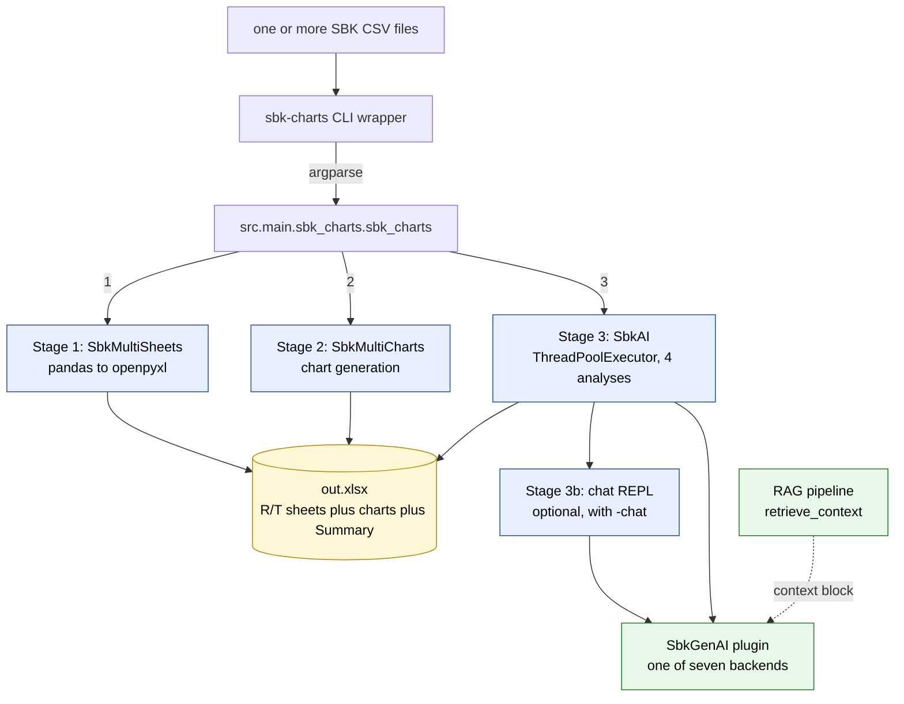
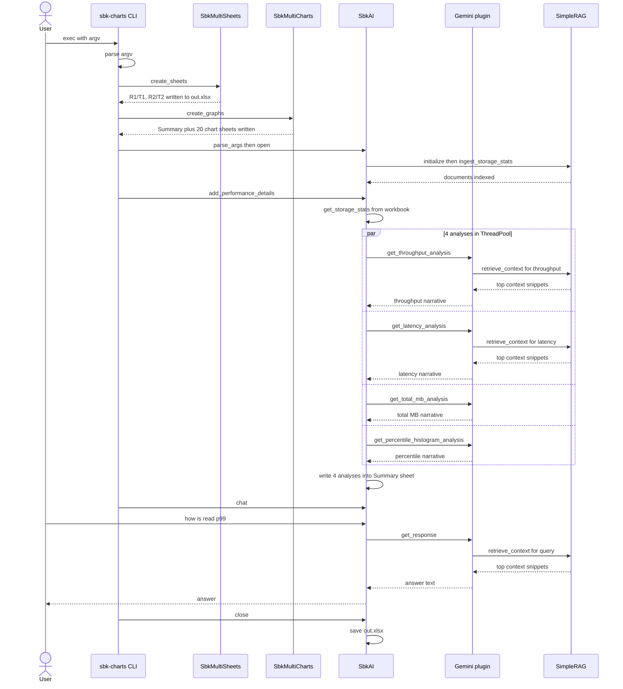

<!--
Copyright (c) KMG. All Rights Reserved.
Licensed under the Apache License, Version 2.0.
-->

# SBK-Charts — Architecture & Internals

> **Audience.** This document is written for three groups:
> - **Fresh engineers** joining the project — gives you a map of the codebase, the conventions, and where to plug new things in.
> - **Research scholars** — explains the design choices, the prompt-engineering pipeline, the RAG fallback, and the open problems worth investigating.
> - **Product managers** — explains *what* sbk-charts is, *why it matters competitively* in AI-assisted performance analytics, and what its current capabilities and gaps are.
>
> If you only need the user-facing manual, read <ref_file file="/root/projects/sbk-charts/README.md" /> instead.

---

## Table of contents

1. [TL;DR — one-page summary](#1-tldr--one-page-summary)
2. [What problem does sbk-charts solve?](#2-what-problem-does-sbk-charts-solve)
3. [Competitive positioning — AI-assisted performance analytics](#3-competitive-positioning--ai-assisted-performance-analytics)
4. [System architecture at a glance](#4-system-architecture-at-a-glance)
5. [Module-by-module deep dive](#5-module-by-module-deep-dive)
   - 5.1 [CLI bootstrap (`src/main`)](#51-cli-bootstrap-srcmain)
   - 5.2 [Argument parser (`src/parser`)](#52-argument-parser-srcparser)
   - 5.3 [Sheets layer (`src/sheets`)](#53-sheets-layer-srcsheets)
   - 5.4 [Charts layer (`src/charts`)](#54-charts-layer-srccharts)
   - 5.5 [Statistics container (`src/stat`)](#55-statistics-container-srcstat)
   - 5.6 [GenAI abstract base (`src/genai`)](#56-genai-abstract-base-srcgenai)
   - 5.7 [AI orchestration (`src/ai`)](#57-ai-orchestration-srcai)
   - 5.8 [RAG pipeline (`src/rag`)](#58-rag-pipeline-srcrag)
   - 5.9 [AI backend plugins (`src/custom_ai`)](#59-ai-backend-plugins-srccustom_ai)
6. [End-to-end data flow](#6-end-to-end-data-flow)
7. [The AI plugin SPI — extending sbk-charts](#7-the-ai-plugin-spi--extending-sbk-charts)
8. [Notable design decisions](#8-notable-design-decisions)
9. [Open research problems](#9-open-research-problems)
10. [Glossary](#10-glossary)
11. [File map (quick reference)](#11-file-map-quick-reference)

---

## 1. TL;DR — one-page summary

**What it is.** A Python tool that turns raw [SBK](https://github.com/kmgowda/SBK) benchmark CSVs into a richly-formatted `.xlsx` workbook containing:

- **R/T worksheets** — one pair per input CSV, split into interval rows (R) and total/summary rows (T).
- **~20 chart sheets** — throughput, latency, percentile, percentile-histogram, write/read, and timeout-event visualisations, with both per-run and multi-run comparisons.
- **A Summary sheet** — metadata (version, drivers, actions, time unit, benchmark date/time table), plus optional AI-generated written analysis.
- **AI analysis** — four canonical narratives (throughput, latency, total MB, percentile histogram) produced in parallel by a pluggable AI backend, optionally enhanced with a built-in RAG pipeline.
- **Chat mode** — an interactive REPL where the AI is grounded on the loaded benchmark data.

**Why it matters.** A traditional benchmarking workflow stops at "here are the numbers". sbk-charts pushes it further: it explains the numbers in natural language and lets a human ask follow-up questions. The AI plumbing is **backend-agnostic** (cloud APIs + local models), and the RAG layer means the model talks about *your* specific run, not generalities.

**Architectural pillars.**

| Pillar | Mechanism |
|---|---|
| **Pipeline** | CSV → openpyxl workbook → charts → AI summary, in that strict order. |
| **R/T split** | Each CSV becomes `R<n>` (per-interval rows) + `T<n>` (totals). All downstream code keys off these prefixes. |
| **Pluggable AI** | Subclasses of `SbkGenAI` are auto-discovered under `src/custom_ai/` and exposed as argparse subcommands. |
| **Parallel AI** | The four analyses run concurrently in a `ThreadPoolExecutor` with a 120 s budget. |
| **RAG-first** | Storage statistics are ingested into a keyword-based "Simple RAG" (no external deps) and used to enrich every prompt. ChromaDB exists as an optional path. |
| **Frozen data** | `StorageStat` is an immutable `@dataclass(frozen=True)` — safe to share across threads. |

---

## 2. What problem does sbk-charts solve?

Storage benchmarking produces large, wide CSVs (90+ columns: per-interval throughput, latency, every percentile from p5 to p99.99, percentile *counts*, timeout events, etc.). A typical SBK run might produce:

```
ID, Date, Time, Header, Type, Connections, ..., Storage, Action, ..., MB/Sec, AvgLatency,
Percentile_5, Percentile_10, ..., Percentile_99.99, Percentile_Count_5, ..., Percentile_Count_99.99
```

Three audiences need to act on this data, and each has a different bottleneck:

| Audience | Bottleneck without sbk-charts |
|---|---|
| **Performance engineers** | Hand-crafting Excel charts after every run. |
| **Engineering managers / customers** | Reading a 50-row CSV with 90 columns and trying to draw a conclusion. |
| **Researchers** | Comparing N runs across M storage drivers under K workloads — combinatorial chart work. |

**sbk-charts collapses all three.** A single command takes one or more SBK CSVs and emits a "presentation-ready" workbook with deterministic chart layout *and* an AI-written narrative.

---

## 3. Competitive positioning — AI-assisted performance analytics

The space of "tools that draw charts from benchmark CSVs" is crowded (Excel, gnuplot, Grafana exports, perf-test report generators). What is rare — and what makes sbk-charts interesting as an **AI-based** performance analytics tool — is the combination of these properties:

### 3.1 What is on the market vs. what sbk-charts does

| Capability | Generic dashboards (Grafana, Excel macros) | LLM-as-a-Service tools (just ChatGPT on a CSV) | **sbk-charts** |
|---|:--:|:--:|:--:|
| Deterministic, repeatable chart layout | ✅ | ❌ | ✅ |
| Side-by-side comparison across runs/drivers | partial | ❌ | ✅ (multi-CSV) |
| Written narrative summarising the run | ❌ | ✅ but generic | ✅, structured into 4 canonical sections |
| Narrative is **grounded** on the actual numbers | ❌ | partial | ✅ via RAG |
| Works offline (local LLMs) | ❌ | ❌ | ✅ (LM Studio, Ollama, PyTorch) |
| Vendor-neutral AI choice | n/a | locked to one vendor | ✅ (7 backends today) |
| Reproducible artefact (single .xlsx) | partial | ❌ | ✅ |
| Interactive follow-up Q&A | ❌ | ✅ but lossy | ✅ chat mode, grounded |

### 3.2 The four "moat" properties

1. **Vendor-portable AI.** Seven backends ship today: Anthropic Claude, Google Gemini, Hugging Face Inference, LM Studio, Ollama, local PyTorch (with optional fine-tuning), and a `NoAI` stub. The same workbook can be produced by any of them — useful for procurement, air-gapped customers, and reproducibility studies.

2. **Grounded analysis via RAG.** The benchmark CSV itself is chunked, tagged, and stored in a retrieval index. Every analysis prompt is enriched with the slice of statistics most relevant to the question. This is what lets the model say *"MinIO sustained 287 MB/s while Ceph dropped to 142 MB/s at p99"* instead of *"storage performance varies."*

3. **Parallel, time-bounded analysis.** Four analyses (throughput, latency, total MB, percentile histogram) run concurrently in a 120-second budget. Slow models do not block the workbook — partial results are still surfaced.

4. **A single artefact.** The final `out.xlsx` contains the data, the charts, the metadata, the AI prose, and the prompt-engineered model description, all in one file. No external dashboards, no broken Looker links a year later. This is uncommon in the dashboard world.

### 3.3 Where it does *not* compete

sbk-charts is not a benchmarking *engine* — that is [SBK](https://github.com/kmgowda/SBK) itself. It is also not a live observability tool: it operates on **completed** CSVs, not real-time streams. And it does not (yet) attempt cross-run anomaly detection or regression diffing — those are open product opportunities (see [§9](#9-open-research-problems)).

---

## 4. System architecture at a glance



The high-level invariant is that the three stages **(1) sheets, (2) charts, (3) AI** are strictly sequential and each stage persists its work to the same `.xlsx` file. A failure or skip in stage 3 (AI) still leaves a fully usable workbook from stages 1+2.

---

## 5. Module-by-module deep dive

### 5.1 CLI bootstrap (`src/main`)

**Entry point.** <ref_file file="/root/projects/sbk-charts/sbk-charts" /> is a 21-line shell-callable Python wrapper that adds the repo root to `sys.path` and calls `src.main.sbk_charts.sbk_charts()`.

The `sbk_charts()` function (<ref_snippet file="/root/projects/sbk-charts/src/main/sbk_charts.py" lines="38-78" />) is the canonical top-level orchestrator:

```python
parser = get_sbk_parser()        # base flags: -i, -o
ch = SbkAI()                     # discovers AI plugins
ch.add_args(parser)              # adds -secs/-nothreads/-chat and AI subparsers
args = parser.parse_args()

sh = SbkMultiSheets(args.ifiles.split(","), args.ofile)
sh.create_sheets()               # stage 1: write R/T sheets

excel_graphs = SbkMultiCharts(args.ofile)
excel_graphs.create_graphs()     # stage 2: write chart sheets + Summary

ch.parse_args(args); ch.open(args)
ch.add_performance_details()     # stage 3: parallel AI narratives
ch.chat()                        # stage 3b (optional): REPL
ch.close(args)
```

### 5.2 Argument parser (`src/parser`)

A thin layer over `argparse`. The base parser only registers `-i/--ifiles` (required, comma-separated) and `-o/--ofile` (default `out.xlsx`). All AI-related flags — including the AI backend subcommands — are added later by `SbkAI.add_args()`, so the parser stays decoupled from the AI plugin set.

### 5.3 Sheets layer (`src/sheets`)

Responsible for turning each input CSV into a pair of worksheets.

**Naming convention.** For the *n*th input CSV (1-indexed), two worksheets are created:

| Sheet | Contains | Constant |
|---|---|---|
| `R<n>` | Rows where `Type != "Total"` — i.e. *per-interval* measurements. | `R_PREFIX = "R"` |
| `T<n>` | Rows where `Type == "Total"` — i.e. aggregate/summary rows. | `T_PREFIX = "T"`, `TYPE_TOTAL = "Total"` |

These constants live in <ref_file file="/root/projects/sbk-charts/src/sheets/constants.py" />. Every downstream piece of code (charts, AI orchestration, RAG) uses `is_r_num_sheet(name)` / `is_t_num_sheet(name)` from `src/charts/utils.py` to classify a sheet.

**Key function.** `wb_add_two_sheets(wb, r_name, t_name, df)` (<ref_snippet file="/root/projects/sbk-charts/src/sheets/sheets.py" lines="39-82" />) takes an `xlsxwriter.Workbook` and a pandas DataFrame, writes the header to both sheets, then walks each row and dispatches it to R or T based on the `Type` column.

**Classes.**

- `SbkSheets` — single-CSV variant (used for unit testing / small jobs).
- `SbkMultiSheets(SbkSheets)` — declared `@final`; iterates the input list and produces `R1/T1, R2/T2, …` in one workbook.

The SBK logo is inserted into a dedicated `SBK` worksheet by `add_sbk_logo()` in <ref_file file="/root/projects/sbk-charts/src/sheets/logo.py" />.

### 5.4 Charts layer (`src/charts`)

This is the largest module by line count (~2 100 LoC across four files).

**Files.**

| File | Purpose |
|---|---|
| `constants.py` | Stable column-name strings (`MB_PER_SEC`, `AVG_LATENCY`, `PERCENTILE_5` … `PERCENTILE_99_99`, plus the 26 `PERCENTILE_COUNT_*` columns and metadata names). All downstream code refers to columns through these constants, never as literal strings. |
| `utils.py` | Worksheet helpers: `is_r_num_sheet`, `is_t_num_sheet`, `get_columns_from_worksheet`, `get_storage_name_from_worksheet`, `get_action_name_from_worksheet`, `get_time_unit_from_worksheet`. Reading them is mandatory before touching the charts code. |
| `charts.py` | `SbkCharts` — single-pair (R1/T1) chart generation. ~1 200 LoC. |
| `multicharts.py` | `SbkMultiCharts(SbkCharts)` — multi-run comparison charts + the **Summary** sheet. |

**Constructor responsibilities** (`SbkCharts.__init__`, <ref_snippet file="/root/projects/sbk-charts/src/charts/charts.py" lines="63-116" />):

- Loads the workbook with openpyxl.
- Reads the latency time unit from R1 (`ns`, `µs`, `ms`, …).
- Pre-computes three latency groupings used throughout the file:

| Field | Meaning | Used by |
|---|---|---|
| `latency_groups` | Five overlapping subsets of the latency columns (`[MIN_LATENCY,P5]`, `[P5..P50]`, `[P50,AVG]`, `[P50..P90]`, `[P92.5..P99.99]`) — these become *separate* latency comparison charts so the y-axis stays readable. | `create_all_latency_compare_graphs` |
| `slc_percentile_names` | Two **SLC (Sustained Latency Coverage)** groups — lower (P5–P50) and upper (P50–P99.99). | Total percentile line charts |
| `percentile_count_names` | The 26 `Percentile_Count_*` columns. | Total percentile histogram |

**Catalogue of charts.** `SbkMultiCharts.create_graphs()` (<ref_snippet file="/root/projects/sbk-charts/src/charts/multicharts.py" lines="674-702" />) orchestrates the full set:

| Method | Output sheet(s) | Source |
|---|---|---|
| `create_summary_sheet` | `Summary` | metadata + benchmark date/time table |
| `create_multi_throughput_mb_graph` | `Throughput_MB` | R-sheets |
| `create_multi_throughput_records_graph` | `Throughput_Records` | R-sheets |
| `create_all_latency_compare_graphs` | 5 sheets, one per `latency_groups` entry | R-sheets |
| `create_multi_latency_compare_graphs` / `_latency_graphs` | per-metric latency charts | R-sheets |
| `create_multi_write_read_records_graph` / `_mb_graph` | W/R record + MB variations | R-sheets |
| `create_multi_write_read_timeout_events_graph` / `_per_sec_graph` | timeout-event variations | R-sheets |
| `create_total_multi_latency_percentile_graphs` | `Total_Percentiles_1`, `Total_Percentiles_2` | T-sheets, SLC groups |
| `create_total_multi_latency_percentile_count_graphs` | `Total_Percentiles_Histogram` | T-sheets |
| `create_total_mb_compare_graph` | `Total_MB` | T-sheets |
| `create_total_throughput_mb_compare_graph` | `Total_Throughput_MB` | T-sheets |
| `create_total_throughput_records_compare_graph` | `Total_Throughput_Records` | T-sheets |
| `create_total_{min,avg,max}_latency_compare_graph` | three latency bar charts | T-sheets |
| `create_total_write_read_timeout_events_compare_graph` | `Total_RW_TimeoutEvents` | T-sheets |

A `check_time_units()` gate runs first — all R-sheets must report the same `LatencyTimeUnit`, otherwise no comparison charts make sense and the multi-chart pipeline aborts.

**The Summary sheet** (`create_summary_sheet`, <ref_snippet file="/root/projects/sbk-charts/src/charts/multicharts.py" lines="100-227" />) is the human-readable cover page of the workbook:

1. Title block (sbk-charts version, generation date, generation time).
2. "Performance Analysis of Storage Drivers: …" line.
3. Time unit.
4. Action → list-of-storages table (e.g. `Reading : FILE, MinIO`).
5. **Benchmark Date/Time table** — five columns: `Sheet Name | Storage | Start Date/Time | End Date/Time | Duration`. The values are extracted from the `Date` and `Time` columns (cols 2 & 3) of each R-sheet, and the duration is computed at workbook-generation time. This block is the landing zone for *when* the benchmark ran, not just *when the workbook was generated* — critical for multi-run regression studies.
6. (After AI runs) the four written analyses are appended into column H by `SbkAI.add_ai_analysis()`.

### 5.5 Statistics container (`src/stat`)

<ref_file file="/root/projects/sbk-charts/src/stat/storage.py" /> defines a single, intentionally minimal data class:

```python
@dataclass(frozen=True)
class StorageStat:
    storage:  Optional[str]              # e.g. "MinIO", "FILE"
    timeunit: Optional[str]              # e.g. "NANOSECONDS"
    action:   Optional[str]              # "Reading", "Writing"
    regular:  Optional[Dict[str, list]]  # per-interval columns (from R-sheet)
    total:    Optional[Dict[str, list]]  # totals columns (from T-sheet)
```

The choice of `frozen=True` is deliberate: `StorageStat` instances are shared across analysis threads in `SbkAI.add_ai_analysis()` and across the chat REPL. Immutability removes a class of races.

Convenience helpers (`get_total_sum_value`, `get_total_avg_value`, …) are tiny but kept here so prompt-building code (in `SbkGenAI`) stays a pure consumer of the dataclass.

### 5.6 GenAI abstract base (`src/genai`)

<ref_file file="/root/projects/sbk-charts/src/genai/genai.py" /> defines `SbkGenAI(ABC)` — the contract every AI backend must satisfy. **This is the file to read first if you are writing a new plugin.**

**Final (non-overridable) methods.** Two slots are reserved by the framework:

- `set_storage_stats(stats)` — called by `SbkAI` after the workbook is loaded.
- `set_rag_pipeline(rag_pipeline)` — called by `SbkAI` after the RAG index is built.

**Abstract methods.** A backend must implement six:

| Method | Purpose |
|---|---|
| `get_model_description()` | A `(success, str)` tuple printed verbatim into the Summary sheet. |
| `get_throughput_analysis()` | Narrative on the MB/sec series. |
| `get_latency_analysis()` | Narrative on Avg/p50/p95/p99.9/Max. |
| `get_total_mb_analysis()` | Narrative on aggregate MB processed. |
| `get_percentile_histogram_analysis()` | Narrative on the percentile-count distribution. |
| `get_response(query)` | Free-form chat answer (used by `SbkAI.chat()`). |

**Lifecycle hooks** (optional overrides): `add_args(parser)`, `parse_args(args)`, `open(args)`, `close(args)`.

**Prompt construction (the interesting part).** `SbkGenAI` does *not* leave prompt-building to the plugin. It ships four ready-made prompt builders (`get_throughput_prompt`, `get_latency_prompt`, `get_total_mb_prompt`, `get_percentile_histogram_prompt`) that:

1. Pull data from `self.storage_stats`.
2. Rank/summarise (e.g. sort storages by avg MB/sec descending).
3. Format a compact metrics table.
4. Wrap it in a persona prompt ("You are a storage performance engineer …").
5. Pass through `_enhance_prompt_with_rag()` if a RAG pipeline is attached.

Plugins simply call these helpers, send the resulting string to their model, and return the response. This means **prompt quality is owned by the framework**, not by each plugin — one place to improve it for everyone.

The `_enhance_prompt_with_rag()` helper (<ref_snippet file="/root/projects/sbk-charts/src/genai/genai.py" lines="65-102" />) retrieves up to 1 000 context snippets from the RAG pipeline, appends them in a `CONTEXTUAL INFORMATION:` block, and lists the available storage systems by name so the model knows what to reference.

### 5.7 AI orchestration (`src/ai`)

This is the largest of the AI-side files (~810 LoC). Two files:

- <ref_file file="/root/projects/sbk-charts/src/ai/discover.py" /> — plugin discovery.
- <ref_file file="/root/projects/sbk-charts/src/ai/sbk_ai.py" /> — orchestration + Excel formatting + chat.

**Plugin discovery** (`discover_custom_ai_classes`, <ref_snippet file="/root/projects/sbk-charts/src/ai/discover.py" lines="21-96" />): walks `src/custom_ai/` with `pkgutil.walk_packages`, imports each submodule, and registers every concrete (non-abstract) subclass of `SbkGenAI` it finds, keyed by lower-cased class name. **Adding a new backend therefore requires zero registration code** — just drop a new package under `src/custom_ai/<name>/` with a `<Name>` class.

If a module fails to import (typically a missing optional dependency, as happened with the Gemini fix earlier in this session), the discoverer logs the error and continues. A broken plugin does not break the others.

**`SbkAI.add_args(parser)`** (<ref_snippet file="/root/projects/sbk-charts/src/ai/sbk_ai.py" lines="161-190" />):

- Adds three top-level flags: `-secs/--seconds` (timeout, default 120), `-nothreads/--nothreads`, `-chat/--chat`.
- Creates an argparse **subparsers** group named `ai_class`, one subparser per discovered plugin, and calls each plugin's `add_args(subp)` to let it declare model-specific flags. The user therefore selects an AI by typing it as a subcommand: `sbk-charts -i in.csv gemini --gemini-model gemini-2.5-pro`.

**`SbkAI.get_storage_stats()`** (<ref_snippet file="/root/projects/sbk-charts/src/ai/sbk_ai.py" lines="303-338" />): iterates every R-sheet, looks up its sibling T-sheet, and produces one `StorageStat` per sheet pair. This is the single source of truth for the AI side — neither the plugins nor the RAG layer re-parse the workbook.

**`SbkAI.add_ai_analysis()` — parallel execution.** The four analyses are executed via `ThreadPoolExecutor(max_workers=4)`:

```python
analysis_methods = [
    'get_throughput_analysis',
    'get_latency_analysis',
    'get_total_mb_analysis',
    'get_percentile_histogram_analysis',
]
future_to_method = {executor.submit(run_analysis, m): m for m in analysis_methods}
```

A polling loop (<ref_snippet file="/root/projects/sbk-charts/src/ai/sbk_ai.py" lines="436-470" />) waits up to 2 seconds at a time, reaps completed futures, and aborts everything once `timeout_seconds` is exceeded — incomplete analyses are marked `(False, "timed out")` so the Summary sheet still has a complete row set.

The `--nothreads` flag falls back to a sequential loop, mostly for debugging plugins that aren't thread-safe (e.g. local PyTorch on a single GPU).

**Excel formatting** (<ref_snippet file="/root/projects/sbk-charts/src/ai/sbk_ai.py" lines="479-627" />): widens column H to 120 chars, writes the standard "AI may hallucinate" red-bold warning, then writes each of the four analyses with a per-section coloured header (purple for Throughput, green for Latency, …). Row heights are computed by *wrapping* each text at 120 chars and multiplying by 25 points — this keeps long narratives readable without manual sizing.

**Chat mode** (`SbkAI.chat`, <ref_snippet file="/root/projects/sbk-charts/src/ai/sbk_ai.py" lines="671-784" />): when `-chat` is passed, after the four-up analysis is done the tool drops into a REPL. Multi-line queries are supported (read until an empty line). Each query is sent on a worker thread; the main loop polls every 5 s and prints progress dots so the user knows it is still alive. `^D` exits, `^C` aborts the current query.

### 5.8 RAG pipeline (`src/rag`)

Two implementations, used as a **two-tier fallback chain**. The default and almost-always-used one is the simpler one.

#### 5.8.1 `SbkSimpleRAGPipeline` — the in-memory, keyword-based default

<ref_file file="/root/projects/sbk-charts/src/rag/sbk_rag.py" /> (~880 LoC). No external dependencies. The pipeline:

1. **Ingests** each `StorageStat` (`_process_storage_stat`, <ref_snippet file="/root/projects/sbk-charts/src/rag/sbk_rag.py" lines="129-208" />): walks the `regular` and `total` dicts; for each non-zero metric, builds a text "document" plus a metadata record.
2. **Tags each document** (`_storage_stat_to_text`) with semantic markers — `Performance_Indicator: excellent`, `Semantic_Type: latency_metric`, `Storage_Comparison_Key: read_throughput`, etc. These tags are what make keyword search behave more like a semantic search without requiring embeddings.
3. **Retrieves** via `retrieve_context(query, n_results=1000)`: extracts keywords from the query, scores each document by keyword overlap, applies hand-rolled boosts (e.g. +10 if the query is about "which storage is better" and the document is tagged `read_throughput`), penalties (e.g. −5 for request-based metrics in throughput comparisons), and finally re-balances across storage systems so no single one dominates the top-k.
4. **Formats** the result with `format_context_for_prompt` into a compact `Storage Systems / Performance Data` block that gets injected into the AI prompt.

The keyword extractor (`_extract_keywords`, <ref_snippet file="/root/projects/sbk-charts/src/rag/sbk_rag.py" lines="473-566" />) does a small amount of *concept expansion*: if you ask about "latency" it also retrieves percentile documents; if you ask about "percentile" it also retrieves latency documents; if you ask "which is faster" it auto-adds throughput, read, and storage-name keywords. This is the closest sbk-charts gets to true semantic retrieval.

#### 5.8.2 `SbkRAGPipeline` — the ChromaDB variant

<ref_file file="/root/projects/sbk-charts/src/rag/sbk_chroma_rag.py" /> (~410 LoC). Uses `sentence-transformers` (`all-MiniLM-L6-v2`) for embeddings and ChromaDB for persistence. Available but **not the default** — the simple RAG is preferred for portability (no native deps, no on-disk state).

#### 5.8.3 Fallback chain

In `SbkAI._initialize_rag_pipeline()` (<ref_snippet file="/root/projects/sbk-charts/src/ai/sbk_ai.py" lines="219-249" />):

```
try Simple RAG
  └─ if init or ingest fails → continue with no RAG (prompt unaffected, just less grounded)
```

The chat mode tolerates a missing RAG: prompts are still sent, just without the context block.

### 5.9 AI backend plugins (`src/custom_ai`)

Seven plugins ship today. Each lives in its own package under `src/custom_ai/<name>/` and is auto-discovered.

| Plugin | Cloud / Local | Library | Env var | Default model | Notes |
|---|---|---|---|---|---|
| `Anthropic` | Cloud | `anthropic` SDK | `ANTHROPIC_API_KEY` | `anthropic-sonnet-4-20250514` | Classic message-create API. |
| `Gemini` | Cloud | `google-genai` (v1.62+) | `GEMINI_API_KEY` | `gemini-2.5-flash` | Uses `genai.Client(...).models.generate_content`. |
| `HuggingFace` | Cloud | `huggingface_hub.InferenceClient` | `HUGGINGFACE_API_TOKEN` | `meta-llama/Llama-3.1-8B-Instruct` | OpenAI-style chat completion against HF Inference. |
| `LmStudio` | Local | `lmstudio` SDK | — | LM Studio's currently-loaded model | Talks to a locally-running LM Studio server on `:1234`. |
| `Ollama` | Local | `requests` (REST) | — | `llama3.1` | Pings `/api/tags` for health, posts to `/api/chat`. |
| `PyTorchLLM` | Local (pure) | `transformers` + `torch` | — | `openai/gpt-oss-20b` | Loads the model in-process; supports optional on-the-fly fine-tuning via `--pt-train`. |
| `NoAI` | Stub | — | — | — | Returns canned "AI not enabled" messages — used when the user wants charts but no narrative. |

Every plugin defaults to **temperature 0.4**, which is sbk-charts' chosen sweet spot between deterministic recital of the numbers and readable prose. Max-token budgets vary (1 800–5 000) per model.

**A typical plugin** (using Gemini as the example, <ref_snippet file="/root/projects/sbk-charts/src/custom_ai/gemini/gemini.py" lines="80-204" />):

```python
class Gemini(SbkGenAI):
    def __init__(self):
        super().__init__()
        self.api_key = os.getenv("GEMINI_API_KEY")
        self.model = "gemini-2.5-flash"
        # ... defaults ...
        if self.api_key:
            self._client = genai.Client(api_key=self.api_key)

    def get_throughput_analysis(self):
        prompt = self.get_throughput_prompt()             # framework-provided
        return self._call_gemini_for_analysis(self.model, prompt)
```

The plugin is essentially a **transport** — the prompt itself comes from `SbkGenAI`, so it is identical across backends and apples-to-apples comparisons are possible.

---

## 6. End-to-end data flow

A precise sequence diagram for a single invocation `sbk-charts -i a.csv,b.csv gemini -chat`:



The key invariant: **stages 1 and 2 commit to disk before stage 3 starts.** If the AI step crashes, the user still gets a complete charts workbook.

---

## 7. The AI plugin SPI — extending sbk-charts

To add a new AI backend (say "Mistral via OpenRouter"):

1. Create a new package: `src/custom_ai/mistral/`.
2. Add `__init__.py` (can be empty).
3. Add `mistral.py` containing a class `Mistral(SbkGenAI)` that implements the six abstract methods.
4. (Optional) Implement `add_args(parser)` to expose model selection, temperature, etc.
5. (Optional) Implement `open(args)` for client initialization.
6. Update `requirements.txt` if you need a new library.
7. Done — no registration needed. `discover_custom_ai_classes` will pick it up, `mistral` becomes a valid subcommand, and your model can be invoked as:

```
sbk-charts -i run.csv mistral --mistral-model mistral-large-2407
```

**Recommended pattern** (drawn from the existing plugins):

```python
class Mistral(SbkGenAI):
    def __init__(self):
        super().__init__()
        self.api_key = os.getenv("MISTRAL_API_KEY")
        self.model = "mistral-large-2407"
        self.max_tokens = 2048
        self.temperature = 0.4

    def add_args(self, parser):
        parser.add_argument("--mistral-model", default=self.model)
        # … etc.

    def parse_args(self, args):
        self.model = args.mistral_model
        # … etc.

    def get_model_description(self):
        if not self.api_key:
            return False, "MISTRAL_API_KEY not set"
        return True, f"Mistral API\n Model: {self.model}\n Temp: {self.temperature}"

    def _call(self, prompt):
        # talk to your provider; return (ok, text)
        ...

    def get_throughput_analysis(self):
        return self._call(self.get_throughput_prompt())
    def get_latency_analysis(self):
        return self._call(self.get_latency_prompt())
    def get_total_mb_analysis(self):
        return self._call(self.get_total_mb_prompt())
    def get_percentile_histogram_analysis(self):
        return self._call(self.get_percentile_histogram_prompt())
    def get_response(self, query):
        return self._call(self._enhance_prompt_with_rag(query, query))
```

That is the entire SPI. The framework owns prompts, RAG, parallelism, timeouts, formatting, and the chat loop — your code only owns **"how do I talk to my model?"**.

---

## 8. Notable design decisions

The following are decisions that an outside reader might find surprising, and that future contributors should preserve unless they have a strong reason not to.

1. **Three strictly-ordered stages.** Sheets → Charts → AI. Each stage saves the workbook before the next begins. This guarantees that an AI crash never costs you charts, and a chart crash never costs you the raw R/T sheets. The CLI is *not* a single transaction.

2. **R/T as the universal addressing scheme.** Every downstream module (charts, AI, RAG) addresses data by R-sheet/T-sheet name. There is no central in-memory model passed between stages; the workbook itself is the IPC channel. This is what lets stages 2 and 3 run independently and even on different machines if you wanted to.

3. **Prompts live in the framework, not the plugin.** This is the single most important design call. It means new plugins are tiny, and improvements to prompts (e.g. better latency table layout) instantly propagate to every backend.

4. **Simple RAG over ChromaDB by default.** ChromaDB pulled in `onnxruntime` and persistent state on disk; both caused friction in air-gapped and locked-down environments. The keyword + semantic-tag approach is good enough for the limited corpus (one workbook's worth of stats) and ships with zero new deps.

5. **Frozen `StorageStat`.** Threads share the stats; immutability eliminates a class of data races without adding a lock.

6. **Hard 120 s wall-clock budget for AI.** A slow local model on a CPU can take minutes to write four analyses. Rather than let the CLI hang, sbk-charts caps the budget and falls back to partial results. Users who need more can pass `-secs 600`.

7. **`@final` on `SbkMultiSheets`, `SbkMultiCharts`, several `SbkGenAI` getters.** Marking these as `@final` signals that extension is expected through the *plugin* SPI, not through subclassing the orchestrator. Future contributors are nudged toward the right extension point.

8. **No global state.** Plugin discovery, RAG, and AI orchestration are all instance-scoped on a fresh `SbkAI()`. The CLI can be re-entered in the same process (useful for tests and chat).

---

## 9. Open research problems

For research scholars and product managers thinking about where this can go.

| # | Open problem | Why it matters | Hook in the codebase |
|---|---|---|---|
| 1 | **Cross-run regression detection.** Today sbk-charts presents N runs side-by-side, but it does not declare a *winner* or flag a regression with statistical confidence. A small classical-stats layer (Mann-Whitney U on per-interval samples) plus a natural-language summary would be high-value. | Closes the loop from "look at the chart" to "answer the question CI is asking." | `get_storage_stats()` already aggregates everything you need. |
| 2 | **Embedding-based RAG as an opt-in.** The simple RAG uses semantic *tags* but not embeddings. A research project could benchmark Simple RAG vs. ChromaDB on a labelled query set ("which storage has the worst tail latency?", etc.) and quantify the retrieval quality gap. | Justifies (or disproves) the default choice. | Both pipelines already exist in `src/rag/`. |
| 3 | **Cost-aware model routing.** With 7 backends ranging from free (NoAI / Ollama) to expensive (Claude Opus, Gemini Pro), an automatic router could pick the cheapest model that satisfies a quality bar. | Reduces analysis cost in CI environments running thousands of benchmarks. | `SbkAI.add_ai_analysis` is the single chokepoint. |
| 4 | **Fine-tuning loop validation.** `PyTorchLLM` already supports `--pt-train` to fine-tune on its own outputs. Whether this is useful — i.e. does the model get measurably better at storage analysis after N runs? — is an open empirical question. | Could turn each customer's CI history into a proprietary advantage. | `src/custom_ai/pytorch_llm/pytorch_llm.py:_train_on_output`. |
| 5 | **Time-series anomaly detection within a single run.** Latency spikes during a run are buried in the per-interval rows but not surfaced in the Summary. A simple z-score / changepoint detector could call them out. | Often more useful than aggregate stats for finding bugs. | R-sheets are already row-addressable. |
| 6 | **Multi-modal output.** Currently the AI sees *numeric tables* of percentiles. Feeding the rendered chart images (e.g. to Gemini Vision) and asking "describe the shape" is unexplored. | Likely catches patterns the table form misses. | `_call_gemini_for_analysis` already takes `contents=` arbitrary list. |
| 7 | **Reproducibility metadata.** The Summary now records when the benchmark ran, but does not record the model version / temperature / prompt revision used for the analysis. A `_AnalysisProvenance` block would make AI-generated narratives auditable. | Critical for academic publication of results. | `get_model_description()` is the obvious anchor. |
| 8 | **Prompt-engineering A/B framework.** Because prompts live in `SbkGenAI` and plugins are pure transports, swapping prompt variants and measuring downstream answer quality on a fixed set of benchmarks is straightforward — but no tooling exists for it yet. | Foundation for systematic prompt optimisation. | `src/genai/genai.py` is the only file to vary. |

---

## 10. Glossary

| Term | Meaning |
|---|---|
| **SBK** | Storage Benchmark Kit — the Java framework that produces the CSVs sbk-charts consumes. See <https://github.com/kmgowda/SBK>. |
| **R-sheet** | A worksheet named `R<n>` containing *per-interval* rows for the nth input CSV. |
| **T-sheet** | A worksheet named `T<n>` containing *total / summary* rows for the nth input CSV. |
| **SLC** | *Sustained Latency Coverage* — a percentile grouping used by sbk-charts to split latency percentiles into two halves (P5–P50 and P50–P99.99) for readable line charts. |
| **Driver / storage class** | A specific storage backend benchmarked by SBK (e.g. `MinIO`, `FILE`, `Cassandra`). |
| **Action** | What was being benchmarked: `Reading`, `Writing`, `Reading_Writing`. |
| **Analysis** | One of the four canonical narratives the AI writes: throughput, latency, total MB, percentile histogram. |
| **Plugin / backend** | A concrete subclass of `SbkGenAI` that talks to one specific model or service. |
| **Simple RAG** | The default keyword + semantic-tag retrieval index in `src/rag/sbk_rag.py`. |
| **Chat mode** | Interactive REPL entered with `-chat`, where the user can ask follow-up questions grounded on the loaded workbook. |

---

## 11. File map (quick reference)

```
sbk-charts/
├── sbk-charts                    # CLI shell wrapper
├── setup.py                      # packaging
├── requirements.txt
├── README.md                     # end-user manual
├── docs/
│   └── ARCHITECTURE.md           # ← you are here
├── images/sbk-logo.png           # inserted into every workbook
├── samples/                      # example SBK CSVs
└── src/
    ├── main/sbk_charts.py        # CLI orchestrator
    ├── parser/sbk_parser.py      # base argparse setup
    ├── version/sbk_version.py    # __sbk_version__ string
    │
    ├── sheets/
    │   ├── sheets.py             # SbkSheets, SbkMultiSheets, wb_add_two_sheets
    │   ├── constants.py          # R_PREFIX, T_PREFIX, TYPE, TYPE_TOTAL
    │   └── logo.py
    │
    ├── charts/
    │   ├── charts.py             # SbkCharts — single-pair charts (~1.2 kLoC)
    │   ├── multicharts.py        # SbkMultiCharts — comparison + Summary
    │   ├── utils.py              # is_r_num_sheet, get_columns_from_worksheet, …
    │   └── constants.py          # column-name constants
    │
    ├── stat/storage.py           # @dataclass(frozen=True) StorageStat
    │
    ├── genai/genai.py            # SbkGenAI abstract base, prompt builders
    │
    ├── ai/
    │   ├── sbk_ai.py             # SbkAI orchestrator (parallel analyses, chat)
    │   └── discover.py           # plugin auto-discovery
    │
    ├── rag/
    │   ├── sbk_rag.py            # SbkSimpleRAGPipeline (default)
    │   └── sbk_chroma_rag.py     # SbkRAGPipeline (ChromaDB, optional)
    │
    └── custom_ai/                # AI plugins — each auto-discovered
        ├── anthropic/anthropic.py
        ├── gemini/gemini.py
        ├── hugging_face/hugging_face.py
        ├── lm_studio/lm_studio.py
        ├── ollama/ollama.py
        ├── pytorch_llm/pytorch_llm.py
        └── no_ai/no_ai.py
```

---

*Last updated alongside sbk-charts 3.26.2.1+.*
