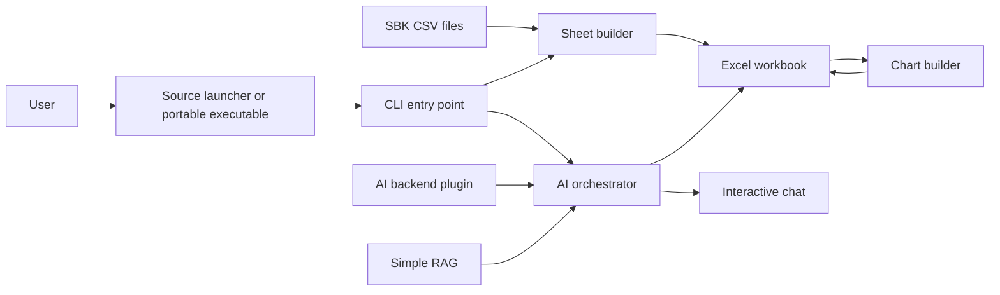
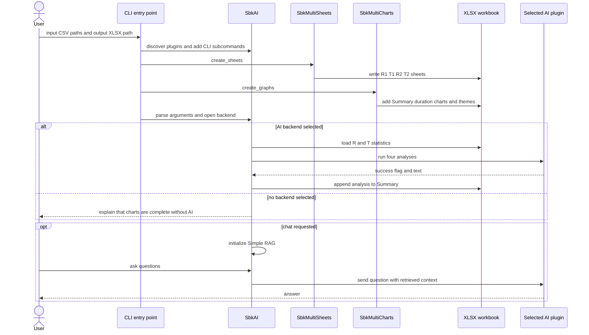
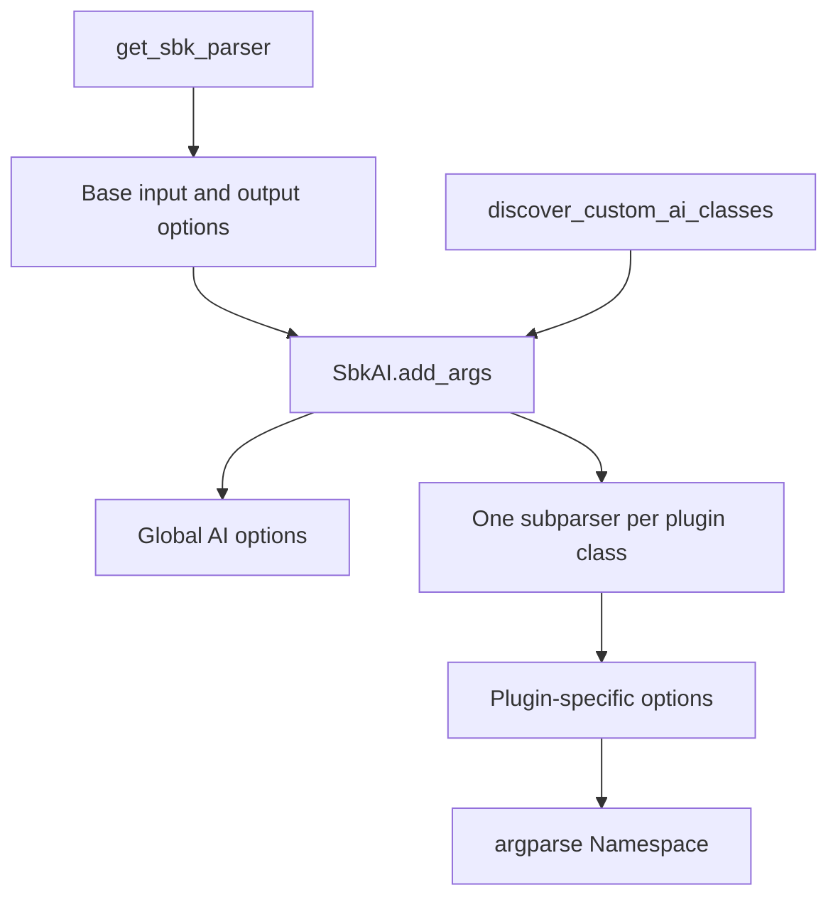
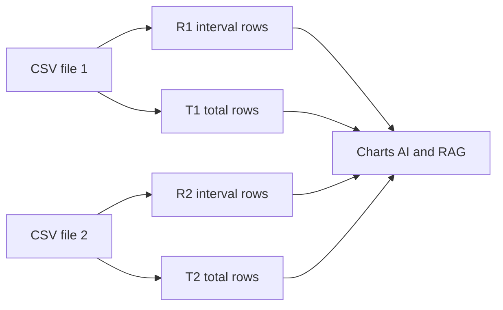
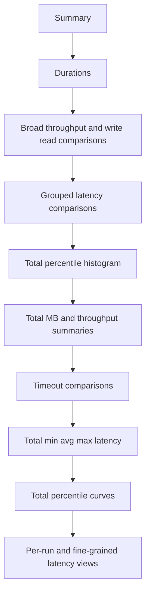
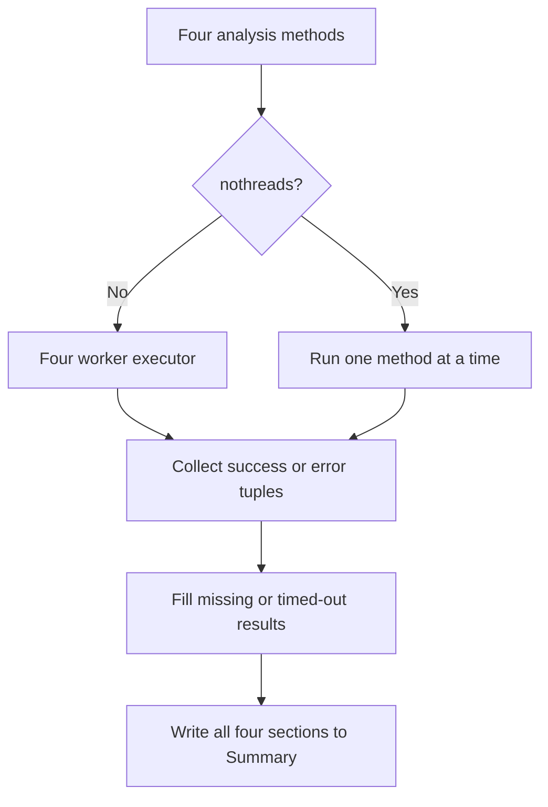
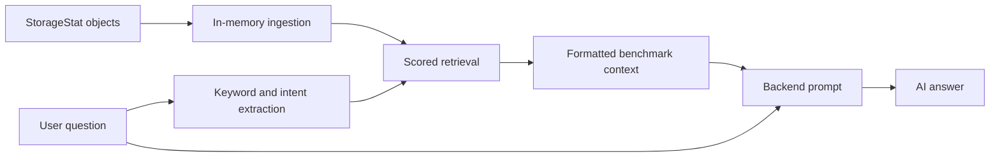
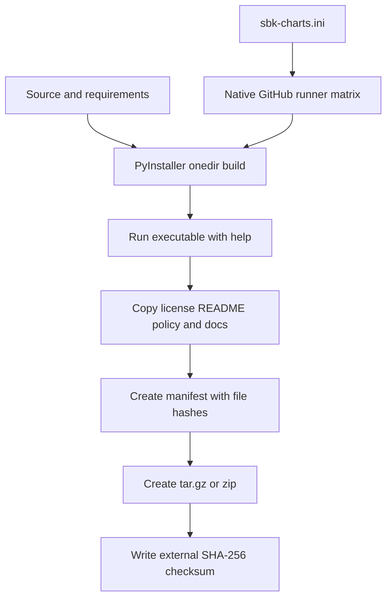

<!--
Copyright (c) KMG. All Rights Reserved.
Licensed under the Apache License, Version 2.0.
-->

# Architecture and internals

This guide explains how sbk-charts works from the command line down to individual workbook cells. Start with the first three sections if you are new to the project. The later sections describe extension points, invariants, release tooling, and failure behavior for experienced engineers.

For installation and usage examples, read the [main README](../README.md). For change procedures, read [AGENTS.md](../AGENTS.md) and [AGENT_RECIPES.md](AGENT_RECIPES.md).

## 1. Purpose and boundaries

SBK is the benchmark producer. It writes wide CSV files containing metadata, per-interval performance values, and total values. sbk-charts is the reporting consumer. It does not run a benchmark and it does not change benchmark results. It converts those results into an Excel report and can optionally ask an AI model to explain them.

The application has five main responsibilities:

1. parse input and output options;
2. split each CSV into regular and total worksheets;
3. create summary tables and charts;
4. optionally create four AI narratives;
5. optionally answer interactive questions grounded in the loaded statistics.

The launchers and release scripts form a separate delivery layer. They find or bundle Python, install dependencies, and start the same application entry point.

## 2. System view


```mermaid
flowchart LR
    U[User] --> L[Source launcher or portable executable]
    L --> M[CLI entry point]
    C[SBK CSV files] --> S[Sheet builder]
    M --> S
    S --> W[Excel workbook]
    W --> G[Chart builder]
    G --> W
    M --> A[AI orchestrator]
    P[AI backend plugin] --> A
    R[Simple RAG] --> A
    A --> W
    A --> Q[Interactive chat]
```

There is one important implementation detail: the workbook is written in stages by two Excel libraries.

- `pandas` reads CSV data.
- `XlsxWriter` creates the first workbook and the R/T data sheets.
- `openpyxl` reopens that workbook, adds summary and chart sheets, applies styles, and later appends AI text.

## 3. End-to-end sequence

The main function is `sbk_charts()` in `src/main/sbk_charts.py`.


```mermaid
sequenceDiagram
    actor User
    participant Main as CLI entry point
    participant AI as SbkAI
    participant Sheets as SbkMultiSheets
    participant Charts as SbkMultiCharts
    participant Book as XLSX workbook
    participant Plugin as Selected AI plugin

    User->>Main: input CSV paths and output XLSX path
    Main->>AI: discover plugins and add CLI subcommands
    Main->>Sheets: create_sheets
    Sheets->>Book: write R1 T1 R2 T2 sheets
    Main->>Charts: create_graphs
    Charts->>Book: add Summary duration charts and themes
    Main->>AI: parse arguments and open backend
    alt AI backend selected
        AI->>Book: load R and T statistics
        AI->>Plugin: run four analyses
        Plugin-->>AI: success flag and text
        AI->>Book: append analysis to Summary
    else no backend selected
        AI-->>User: explain that charts are complete without AI
    end
    opt chat requested
        AI->>AI: initialize Simple RAG
        User->>AI: ask questions
        AI->>Plugin: send question with retrieved context
        Plugin-->>User: answer
    end
```

The stage order is an architectural invariant. Chart code expects R/T sheets to exist. AI code expects the Summary sheet and charts stage to have finished.

## 4. Repository map

| Path | Responsibility | Main abstractions |
|---|---|---|
| `src/main/` | Application entry point and banner | `sbk_charts()` |
| `src/parser/` | Base input/output arguments | `get_sbk_parser()` |
| `src/sheets/` | CSV parsing and initial workbook creation | `SbkSheets`, `SbkMultiSheets` |
| `src/charts/` | Data lookup, tables, all charts, Summary sheet | `SbkCharts`, `SbkMultiCharts` |
| `src/stat/` | Immutable AI-facing data transfer object | `StorageStat` |
| `src/genai/` | Backend interface and shared prompts | `SbkGenAI` |
| `src/ai/` | Discovery, execution, timeout, Excel AI layout, chat | `SbkAI` |
| `src/rag/` | Retrieval for chat and prompt grounding | `SbkSimpleRAGPipeline`, optional `SbkRAGPipeline` |
| `src/custom_ai/` | Provider and local-model adapters | Seven `SbkGenAI` subclasses |
| `src/version/` | Canonical release version | `__sbk_version__` |
| `scripts/` | Policy reader, portable entry point, portable builder | `project_policy.py`, `build_portable.py` |
| `tests/` | Runtime-policy and portable-build unit tests | `test_portable.py` |
| `.github/workflows/` | Linux lint/tests, Windows launcher smoke tests, native portable builds | GitHub Actions jobs |
| `.devin/skills/` | Task instructions for Devin and other capable agents | Build, chart, plugin, troubleshooting skills |

## 5. Command-line construction

`src/parser/sbk_parser.py` creates only the base parser:

- `-i` / `--ifiles`, required and comma-separated;
- `-o` / `--ofile`, default `out.xlsx`.

`SbkAI.add_args()` adds the cross-backend AI options:

- `-secs` / `--seconds`;
- `-nothreads`;
- `-chat`.

It then discovers backend classes and creates one argparse subcommand for each class. Every plugin owns its own `add_args()` and `parse_args()` methods. A new backend therefore does not require an edit to the base parser.


```mermaid
flowchart TD
    A[get_sbk_parser] --> B[Base input and output options]
    B --> C[SbkAI.add_args]
    D[discover_custom_ai_classes] --> C
    C --> E[Global AI options]
    C --> F[One subparser per plugin class]
    F --> G[Plugin-specific options]
    G --> H[argparse Namespace]
```

Argparse treats the backend name as a boundary. Global flags go before the backend and plugin flags go after it.

## 6. CSV-to-sheet layer

`SbkMultiSheets.create_sheets()` opens an XlsxWriter workbook, creates an `SBK` cover sheet with the project logo, and processes input files in command-line order. File one becomes `R1` and `T1`, file two becomes `R2` and `T2`, and so on.

`wb_add_two_sheets()` reads the `Type` column:

```text
Type == "Total"  -> T<n>
every other Type -> R<n>
```

The CSV header is copied to row 1. Column widths begin at the header width and expand when a value is longer. The SBK logo and cover sheet are inserted once during initial workbook creation.

The R/T naming scheme is the universal address system for the rest of the program:


```mermaid
flowchart LR
    C1[CSV file 1] --> R1[R1 interval rows]
    C1 --> T1[T1 total rows]
    C2[CSV file 2] --> R2[R2 interval rows]
    C2 --> T2[T2 total rows]
    R1 --> X[Charts AI and RAG]
    T1 --> X
    R2 --> X
    T2 --> X
```

`src/charts/utils.py` recognizes only names matching `R<digits>` and `T<digits>`. Other sheets are safely ignored when statistics are collected.

## 7. Chart layer

### 7.1 Base and multi-run classes

`SbkCharts` in `src/charts/charts.py` provides reusable operations:

- map worksheet headers to column indexes;
- create openpyxl `Series` objects from named metrics;
- create line and bar charts;
- split percentile sets into readable groups;
- create per-run latency, percentile, histogram, and throughput sheets;
- apply shared chart and table themes.

`SbkMultiCharts` extends that behavior across every R/T pair. It creates the Summary and Durations sheets, comparisons across runs, totals, and the final workbook order.

Exact SBK column names live in `src/charts/constants.py`. Sheet prefixes and the `Type == Total` value live in `src/sheets/constants.py`. Chart code should never repeat an SBK header string inline.

### 7.2 Workbook order

`SbkMultiCharts.create_graphs()` deliberately places large comparisons before fine-grained views:


```mermaid
flowchart TD
    A[Summary] --> B[Durations]
    B --> C[Broad throughput and write read comparisons]
    C --> D[Grouped latency comparisons]
    D --> E[Total percentile histogram]
    E --> F[Total MB and throughput summaries]
    F --> G[Timeout comparisons]
    G --> H[Total min avg max latency]
    H --> I[Total percentile curves]
    I --> J[Per-run and fine-grained latency views]
```

Representative generated names include:

- `Summary` and `Durations`;
- `Throughput_MB` and `Throughput_Records`;
- `Write_Read_MB` and `Write_Read_Records`;
- `Total_Percentiles_Histogram`;
- `Total_MB`, `Total_Throughput_MB`, and `Total_Throughput_Records`;
- `RW_TimeoutEvents` and `RW_TimeoutEvents_Per_Sec`;
- `Total_Min_Latency`, `Total_Avg_Latency`, and `Total_Max_Latency`;
- `Total_RW_TimeoutEvents`;
- grouped and per-run latency and percentile sheets.

Some long chart families are split across numbered sheets so labels and lines remain readable.

### 7.3 Time-unit safety

Before adding graphs, `check_time_units()` reads the latency unit from every R sheet. If units differ, comparison charts are not created. This prevents a visually convincing but invalid comparison, such as plotting nanoseconds and milliseconds on the same axis.

### 7.4 Presentation policy

Chart dimensions, font sizes, line colors, table fills, row heights, widths, legends, and grid styles are presentation policy. They are grouped in the chart implementation rather than in global runtime configuration. `apply_table_theme()` and `apply_chart_theme()` run after sheet creation so all generated sheets receive consistent formatting.

## 8. Summary sheet ownership

The Summary sheet has two writers.

1. `SbkMultiCharts.create_summary_sheet()` creates report metadata, driver/action information, and the latency unit. `create_sbk_date_sheet()` writes benchmark start, end, and elapsed time to the separate Durations sheet.
2. `SbkAI.add_ai_analysis()` later appends the AI warning, model description, and four narratives in columns G and H.

The AI block uses `sheet.max_row` plus spacing to choose its start row. Adding rows to the chart-owned section automatically moves AI content down. Moving the AI columns or changing their meaning requires coordinated changes in both modules.

## 9. Statistics model

`SbkAI.get_storage_stats()` visits every R sheet, finds its matching T sheet, and converts both into one `StorageStat`:

```text
StorageStat(
    storage=<driver name>,
    timeunit=<latency unit>,
    action=<read or write action>,
    regular={<metric>: [interval values...]},
    total={<metric>: [total values...]},
)
```

Metadata columns such as ID, Header, Type, Storage, Action, and Latency Time Unit are excluded from the metric mappings.

`StorageStat` is a frozen dataclass. This makes the container safe to share between analysis workers, but its nested dictionaries are not deeply immutable. Existing code builds complete mappings before construction and treats them as read-only afterward.

## 10. AI plugin system

### 10.1 Discovery

`discover_custom_ai_classes()` recursively imports modules below `src.custom_ai`. It selects concrete classes that directly or indirectly inherit `SbkGenAI`. The lowercase class name becomes the command:

```text
Gemini      -> gemini
HuggingFace -> huggingface
LmStudio    -> lmstudio
PyTorchLLM  -> pytorchllm
```

If a plugin import raises an exception, discovery prints the error and continues. This protects unrelated backends, but it means the failing backend disappears from help output.

### 10.2 Interface

`SbkGenAI` defines lifecycle hooks, model description, four analysis methods, and chat response behavior. A backend normally implements:

- `add_args(parser)` and `parse_args(args)`;
- `open(args)` and `close(args)` when it owns resources;
- `get_model_description()`;
- `get_throughput_analysis()`;
- `get_latency_analysis()`;
- `get_total_mb_analysis()`;
- `get_percentile_histogram_analysis()`;
- `get_response(query)` for chat.

All result methods use `(success: bool, text: str)`. Expected provider, authentication, network, or model errors should be returned as readable failure text rather than escaping to the orchestrator.

### 10.3 Canonical prompts

The shared prompt builders live in `src/genai/genai.py`, not in individual plugins. They format the same `StorageStat` data for every backend. This gives cloud and local models the same analytical task and keeps prompt improvements in one place.

| Prompt | Main metrics |
|---|---|
| Throughput | MB/sec, records/sec, write/read rates |
| Latency | minimum, average, maximum, and latency series |
| Total MB | total transferred data |
| Percentile histogram | latency percentile and percentile-count distributions |

Plugins can add provider-specific transport and chat framing, but should reuse the canonical analysis prompts unless a reviewed requirement says otherwise.

### 10.4 Current backends

| Command | Adapter | Location | Main external need |
|---|---|---|---|
| `anthropic` | Anthropic Python SDK | `src/custom_ai/anthropic/` | API key and network |
| `gemini` | Google Gen AI SDK | `src/custom_ai/gemini/` | API key and network |
| `huggingface` | Hugging Face inference client | `src/custom_ai/hugging_face/` | API token and network |
| `lmstudio` | LM Studio SDK | `src/custom_ai/lm_studio/` | Reachable LM Studio server |
| `ollama` | HTTP requests to Ollama | `src/custom_ai/ollama/` | Reachable Ollama server and downloaded model |
| `pytorchllm` | Transformers and PyTorch | `src/custom_ai/pytorch_llm/` | Model files and enough CPU, RAM, or GPU memory |
| `noai` | Deterministic placeholder | `src/custom_ai/no_ai/` | Nothing |

## 11. AI execution and timeout behavior

By default, `SbkAI.add_ai_analysis()` submits four analysis methods to a `ThreadPoolExecutor` with four workers. It polls for completed futures and applies one total time budget, default 120 seconds. Remaining results receive timeout text when the budget is exceeded.

With `-nothreads`, the same methods run sequentially. The elapsed budget is checked after each method. Sequential mode is useful for debugging and for models that cannot safely handle four simultaneous calls, especially a large model on one GPU.


```mermaid
flowchart TD
    A[Four analysis methods] --> B{nothreads?}
    B -- No --> C[Four worker executor]
    B -- Yes --> D[Run one method at a time]
    C --> E[Collect success or error tuples]
    D --> E
    E --> F[Fill missing or timed-out results]
    F --> G[Write all four sections to Summary]
```

The application saves provider error text into the report so chart generation is still useful when AI is unavailable.

## 12. Retrieval and chat

Chat mode uses `SbkSimpleRAGPipeline` by default. It is an in-memory retrieval system and needs no vector database.

At initialization it:

1. receives `StorageStat` objects;
2. turns non-trivial total metrics into text documents and metadata;
3. skips metrics whose values are all zero;
4. extracts storage-system names and semantic tags;
5. stores the documents in memory.

For a question it extracts keywords, recognizes comparison intent, scores stored documents, returns relevant measurements, and formats them as context. `SbkGenAI._enhance_prompt_with_rag()` adds that context before the plugin sends the request to its model.


```mermaid
flowchart LR
    S[StorageStat objects] --> I[In-memory ingestion]
    Q[User question] --> K[Keyword and intent extraction]
    I --> R[Scored retrieval]
    K --> R
    R --> C[Formatted benchmark context]
    C --> P[Backend prompt]
    Q --> P
    P --> A[AI answer]
```

`src/rag/sbk_chroma_rag.py` contains an optional ChromaDB-based implementation, but the normal application path does not instantiate it. Do not describe ChromaDB as a runtime requirement.

## 13. Self-bootstrap architecture

There are three source launchers:

- `sbk-charts` for Bash on Linux and macOS;
- `sbk-charts.ps1` for PowerShell;
- `sbk-charts.bat`, which delegates to PowerShell for Command Prompt users.

They use native shell logic to read `sbk-charts.ini` because Python may not exist yet. After choosing Python, they use `scripts/project_policy.py` for shared validation, runtime reporting, and remembered-environment state.

When `SBK_CHARTS_VENV` is not set, the selection order is:

1. last validated environment from the state file;
2. active virtual or Conda environment;
3. known project-local virtual environments;
4. the configured existing Conda environment;
5. a newly created virtual environment;
6. a newly created Conda environment.

When `SBK_CHARTS_VENV` is set, the launcher tries that explicit path first and skips remembered, active, and project-local candidates. If it cannot use the explicit venv, it continues with the named Conda and environment-creation paths.

An environment is reusable only when it has a supported Python, the installed distribution version matches the source version, the application module imports, and the dependency check succeeds. The selected validated venv or Conda runtime is written atomically to `.sbk-charts-runtime` immediately before the application process starts.

## 14. Runtime and artifact policy

`sbk-charts.ini` is the shared source of truth for values used by launchers, packaging, CI, and portable builds:

- application and distribution identity;
- Python minimum and interpreter search order;
- environment names and runtime state filename;
- entry point, requirements file, version file, and package data;
- portable targets, runners, formats, manifest, checksum, and bundle paths.

`scripts/project_policy.py` loads these values into frozen dataclasses, validates cross-field consistency, reads requirements safely, reads the version with Python's AST, emits the CI matrix, and provides runtime-state helpers.

Domain settings remain in their domain modules. CSV header strings belong in chart constants, visual sizes and colors belong in chart code, AI defaults belong in their plugin, and retrieval scores belong in the RAG algorithm. See [POLICY.md](POLICY.md) for the ownership rules.

## 15. Packaging and portable releases

`setup.py` consumes project policy rather than repeating package name, entry point, requirements path, version path, or package-data values. A wheel installs a normal `sbk-charts` console script.

Portable builds use PyInstaller in one-directory mode:


```mermaid
flowchart TD
    A[sbk-charts.ini] --> B[Native GitHub runner matrix]
    C[Source and requirements] --> D[PyInstaller onedir build]
    B --> D
    D --> E[Run executable with help]
    E --> F[Copy license README policy and docs]
    F --> G[Create manifest with file hashes]
    G --> H[Create tar.gz or zip]
    H --> I[Write external SHA-256 checksum]
```

Supported targets are currently Linux x86-64, macOS Apple silicon, and Windows x86-64. Each archive is built on its native GitHub runner. Windows ZIP member names are normalized to `/` separators. The Linux workflow installs the CPU-only PyTorch wheel to avoid bundling unused CUDA runtimes.

Portable archives are checksummed but not code-signed or notarized.

## 16. Tests and CI

`tests/test_portable.py` covers policy parsing and validation, safe requirements parsing, AST version lookup, portable argument forwarding, archive creation, Windows ZIP names, environment validation, runtime details, remembered state, and launcher/workflow contracts.

The main CI workflow:

- reads the minimum Python version from policy;
- runs flake8 syntax and undefined-name checks;
- runs the portable-policy unit tests;
- creates a Windows virtual environment and smoke-tests both Windows launchers.

The portable workflow:

- reads its native build matrix from policy;
- installs application and portable build requirements;
- reruns tests;
- builds and smoke-tests an archive;
- uploads build artifacts and, for release events, attaches them to the release.

The Excel pipeline still requires an end-to-end sample run because unit tests do not verify chart rendering or all workbook behavior.

## 17. Architectural invariants

Preserve these rules unless a reviewed design explicitly changes them:

1. Workbook stages run in this order: data sheets, charts and Summary, optional AI text.
2. Data sheets are named `R<digits>` and `T<digits>`.
3. Every R sheet has a corresponding T sheet with the same numeric suffix.
4. Compared R sheets use one latency time unit.
5. Exact CSV headers come from `src/charts/constants.py`.
6. Shared analysis prompts live in `SbkGenAI`, not provider plugins.
7. Plugin discovery failures do not stop unrelated plugins.
8. AI methods return `(bool, text)` and failures remain visible in the workbook.
9. `StorageStat` is constructed completely and then treated as read-only.
10. Summary layout changes account for both chart and AI writers.
11. Runtime and artifact metadata shared across systems belongs in `sbk-charts.ini`.
12. Generated workbooks, environments, models, and build artifacts are not committed.

## 18. Common extension paths

| Goal | Start here | Also inspect |
|---|---|---|
| Add a chart | `src/charts/multicharts.py` | `charts.py`, `constants.py`, `utils.py` |
| Change workbook styling | `src/charts/charts.py` | Summary styling in `multicharts.py` and `sbk_ai.py` |
| Change CSV split behavior | `src/sheets/sheets.py` | `sheets/constants.py`, every R/T caller |
| Add an AI backend | `src/custom_ai/<name>/` | `genai.py`, `discover.py`, plugin spec |
| Change all AI prompts | `src/genai/genai.py` | every backend's response limits |
| Change AI scheduling | `src/ai/sbk_ai.py` | timeout and thread-safety behavior |
| Change chat retrieval | `src/rag/sbk_rag.py` | `genai.py`, `sbk_ai.py` |
| Change bootstrap policy | `sbk-charts.ini` | both launchers, policy tests, docs |
| Add a portable target | `sbk-charts.ini` | workflow, builder, tests, portable docs |

Detailed procedures and acceptance checks are in [AGENT_RECIPES.md](AGENT_RECIPES.md).

## 19. Failure model

| Failure | Expected behavior |
|---|---|
| No supported Python and no usable Conda | Launcher exits with an explanation. |
| Environment is stale or dependencies fail validation | Launcher attempts repair or another environment. |
| Input CSV cannot be read | Sheet creation fails; no valid report can be produced. |
| Compared latency units differ | Graph generation is skipped to avoid invalid charts. |
| One plugin cannot import | It is omitted; other plugins remain available. |
| AI credential or service is unavailable | Backend returns readable failure text; charts remain usable. |
| AI exceeds its time budget | Missing results are marked timed out. |
| Chat retrieval finds little context | The backend still receives the question, but its answer may be more general. |
| Portable executable fails its help smoke test | Archive creation fails. |

## 20. Glossary

| Term | Meaning |
|---|---|
| SBK | Storage Benchmark Kit, the upstream benchmark producer. |
| R sheet | Regular per-interval rows for one input CSV. |
| T sheet | Total rows for the matching input CSV. |
| Percentile | A latency boundary, such as p99, below which that percentage of observations falls. |
| Percentile count | The count associated with a latency percentile bucket in SBK output. |
| Backend | An adapter that sends shared prompts to a cloud API, local server, or local model. |
| RAG | Retrieval-augmented generation: adding relevant benchmark facts to an AI prompt. |
| Source launcher | A shell script that finds or creates Python and installs the checkout. |
| Portable archive | A native release bundle containing the application, Python, and dependencies. |
| Policy | Shared runtime and artifact metadata stored in `sbk-charts.ini`. |
