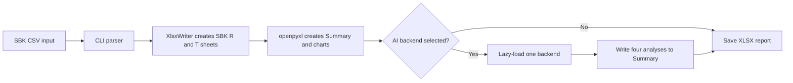
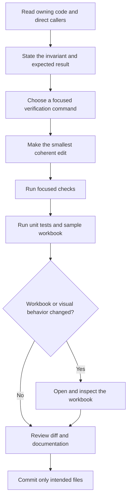

<!--
Copyright (c) KMG. All Rights Reserved.

Licensed under the Apache License, Version 2.0 (the "License");
you may not use this file except in compliance with the License.
You may obtain a copy of the License at

    http://www.apache.org/licenses/LICENSE-2.0
-->

# Development guide

This guide is the shortest path from a fresh clone to a safe code change. It is written for new engineers and software agents. You do not need to understand every chart or AI backend before you begin.

Read [README.md](../README.md) first if you only want to run sbk-charts. Read [ARCHITECTURE.md](ARCHITECTURE.md) when you need the complete design. Use [AGENT_RECIPES.md](AGENT_RECIPES.md) for step-by-step change procedures.

## The project in one picture



The source launcher is a delivery layer in front of this pipeline. It finds or creates a valid Python environment, reports what it selected, and then invokes `src.main.sbk_charts`.

## First 30 minutes

1. Clone the repository and enter its root directory.
2. Read `AGENTS.md`. It contains invariants and safety rules that apply to every change.
3. Ask the launcher for help:

   ```bash
   ./sbk-charts -h
   ```

4. Generate a small report without contacting an AI service:

   ```bash
   ./sbk-charts \
     -i samples/charts/sbk-file-read.csv \
     -o /tmp/sbk-charts-first-report.xlsx
   ```

5. Confirm that Python can open the result and that `Summary` exists:

   ```bash
   venv-sbk-charts/bin/python -c \
     "import openpyxl; w=openpyxl.load_workbook('/tmp/sbk-charts-first-report.xlsx'); print(len(w.sheetnames), 'Summary' in w.sheetnames)"
   ```

6. Run the unit tests before editing so you know the starting state:

   ```bash
   venv-sbk-charts/bin/python -m unittest discover -s tests -v
   ```

If `venv-sbk-charts/bin/python` does not exist, create the development environment with the commands in [AGENTS.md](../AGENTS.md#5-development-setup). The self-bootstrap launcher environment is for running the application; a named development venv makes test commands predictable.

## How to find the right code

Start from behavior, not from filenames.

| Change or problem | Begin with | Then read |
|---|---|---|
| Input or output flags | `src/parser/sbk_parser.py` | `src/main/sbk_charts.py` |
| CSV splitting or R/T sheets | `src/sheets/sheets.py` | Architecture section 6 |
| Chart data, style, or order | `src/charts/` | Recipes 3 through 6 |
| Summary AI text | `src/ai/sbk_ai.py` | Summary two-writer rule |
| Shared AI prompts | `src/genai/genai.py` | Every backend adapter |
| One AI provider | `src/custom_ai/<backend>/` | Registry and plugin specification |
| Chat grounding | `src/rag/sbk_rag.py` | Architecture section 12 |
| Source bootstrap | Root launchers | Policy helper and recipe 11 |
| Self-extracting portable releases | `scripts/build_portable.py` | `docs/PORTABLE.md` |
| Complete GitHub release | `scripts/create_github_release.py` | `docs/RELEASING.md` |

Useful discovery commands:

```bash
rg --files src scripts tests
rg -n "create_graphs|create_summary_sheet" src/charts
rg -n "BACKENDS|load_backend_class" src/ai
rg -n "runtime_state|managed_python" sbk-charts sbk-charts.ps1 scripts sbk-charts.ini
```

## The safe change loop



Before editing, write down what must remain true. Examples:

- A chart change must keep `R<n>` and `T<n>` names stable.
- A Summary change must account for both `multicharts.py` and `sbk_ai.py`.
- A backend change must not import its optional SDK during `-h`.
- A launcher change must preserve saved-environment reuse and fallback cleanup.

## Useful execution examples

Create a single-run report:

```bash
./sbk-charts -i samples/charts/sbk-file-read.csv -o /tmp/one-run.xlsx
```

Compare two runs:

```bash
./sbk-charts \
  -i samples/charts/sbk-file-read.csv,samples/charts/sbk-rocksdb-read.csv \
  -o /tmp/two-runs.xlsx
```

Exercise the AI layout without credentials or network calls:

```bash
./sbk-charts \
  -i samples/charts/sbk-file-read.csv \
  -o /tmp/noai-layout.xlsx \
  noai
```

Show one backend's flags without importing unrelated provider SDKs:

```bash
./sbk-charts -i samples/charts/sbk-file-read.csv gemini -h
```

Test sequential AI scheduling with a local service:

```bash
./sbk-charts -i input.csv -o /tmp/local-ai.xlsx \
  -secs 600 -nothreads ollama --ollama-model llama3.1
```

Global flags such as `-secs` and `-nothreads` go before the backend name. Backend flags go after it.

## Verification layers

Use checks proportional to the change.

| Layer | What it proves | What it does not prove |
|---|---|---|
| `bash -n sbk-charts` | Bash parses | Runtime selection works |
| Flake8 `E9,F63,F7,F82` | Python parses and names resolve | Business behavior is correct |
| Unit tests | Policy, packaging, and launcher contracts | Excel charts render well |
| openpyxl workbook load | XLSX structure is readable | Fonts, colors, and charts look good |
| Excel or LibreOffice inspection | Visual quality and chart placement | Other operating systems work |
| Native CI jobs | Launcher behavior on their OS | Unavailable providers or GPUs work |

The normal complete local check is:

```bash
venv-sbk-charts/bin/python -m unittest discover -s tests -v
bash -n sbk-charts
venv-sbk-charts/bin/python -m flake8 . \
  --count --select=E9,F63,F7,F82 --show-source --statistics
./sbk-charts -i samples/charts/sbk-file-read.csv \
  -o /tmp/sbk-charts-verify.xlsx
git diff --check
git status --short
```

For packaging changes, also run:

```bash
venv-sbk-charts/bin/python -m build --wheel --sdist
```

## Inspecting a workbook

This command prints the sheet order without changing the file:

```bash
venv-sbk-charts/bin/python -c \
  "import openpyxl; w=openpyxl.load_workbook('/tmp/sbk-charts-verify.xlsx'); print('\\n'.join(w.sheetnames))"
```

Use openpyxl assertions for structure, names, formulas, dimensions, and chart counts. Use Excel, LibreOffice, or another renderer for fonts, colors, line contrast, legends, clipping, and placement. A workbook that loads successfully can still be difficult to read.

## Debugging by symptom

| Symptom | First checks |
|---|---|
| Launcher rebuilds every time | Runtime report, `.sbk-charts-runtime`, selected profile, lock fingerprint |
| Backend is listed but import fails | Directly load that registry entry and inspect its optional requirements |
| A comparison chart is absent | Required header, R/T pairing, common latency unit |
| AI text is absent | Backend selection, provider error text, Summary writer positions |
| Chat answer is generic | Collected `StorageStat` objects and Simple RAG retrieval output |
| Wheel misses an asset | `sbk-charts.ini`, `setup.py`, and `MANIFEST.in` ownership |

The detailed diagnostic commands are in the [common-issues skill](../.devin/skills/fix-common-issues/SKILL.md).

## Context packet for software agents

An agent should collect this small context before proposing a change:

```text
1. git status --short --branch
2. the owning source file
3. its direct caller and constants
4. the matching architecture section
5. the matching recipe
6. the focused verification command
7. any platform, credential, GPU, or visual limitation
```

Do not load every generated workbook or dependency lock into context unless the task needs it. Search for symbols and read direct callers first. Preserve unrelated working-tree changes and never claim tests that were not actually run.

## Ready for review

A change is ready when:

- the user-visible behavior is explained in plain English;
- the smallest relevant test passes;
- the full unit suite and sample workbook pass when code changed;
- visual changes were rendered and inspected;
- documentation and examples use current names and flags;
- `git diff --check` is clean;
- untested operating systems, services, credentials, or hardware are stated clearly.
