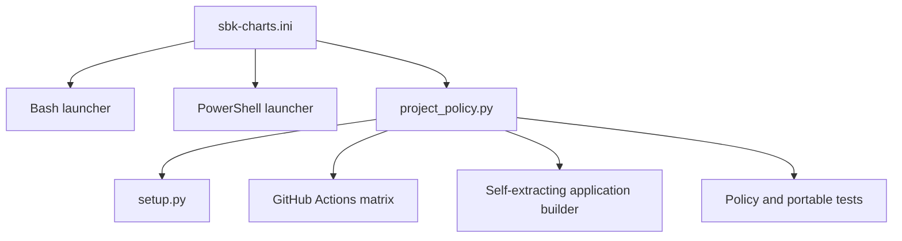

<!--
Copyright (c) KMG. All Rights Reserved.

Licensed under the Apache License, Version 2.0 (the "License");
you may not use this file except in compliance with the License.
You may obtain a copy of the License at

    http://www.apache.org/licenses/LICENSE-2.0
-->

# Runtime and artifact policy

`sbk-charts.ini` is the single configuration file for metadata that several delivery systems need. It prevents the Bash launcher, PowerShell launcher, package builder, CI workflows, and portable builder from keeping different copies of the same value.

This policy controls how sbk-charts starts and how release artifacts are named and assembled. It does not control benchmark calculations or workbook appearance.

## Consumers



Bash and PowerShell use small native INI readers because the launcher cannot assume Python is already installed. After an interpreter is available, `scripts/project_policy.py` provides typed and validated access.

## Sections and owners

### `[application]`

Defines the command and distribution identity, Python module and entry point, description, project URL, license label, author metadata, version-file path, and runtime-requirements path.

Consumers include `setup.py`, launchers, and portable builds.

### `[package_data]`

Maps Python packages to non-Python files that must be included, such as the banner and logo.

### `[runtime]`

Defines:

- minimum supported Python;
- exact managed Python and managed runtime directory;
- maximum wait for another process to finish managed bootstrap;
- default Conda environment name;
- remembered-environment state filename and schema version;
- project virtual-environment names;
- Unix interpreter search order;
- Windows interpreter launcher search order.

### `[bootstrap]`

Pins the standalone runtime manager version, official download base URL, native archives, and SHA-256 checksums. Adding a target requires both an archive and checksum.

### `[ai.requirements]`

Maps each optional backend command to its human-maintained requirements input. `requirements-lock/<profile>.txt` contains the exact hashed solution used by managed environments. Every profile combines core `requirements.txt` with `requirements-bootstrap.txt`; backend profiles also add their file from `requirements-ai/`. Managed editable installation disables build isolation so it cannot bypass these hashes.

### `[portable]`

Defines native target names, build Python, manifest and checksum names, portable runtime state schema and cache directory, extraction-lock timeout, bundled documentation and metadata paths, entry script, and modules PyInstaller must collect.

The related mapping sections connect targets to operating systems, processor names, embedded payload formats, self-extracting output extensions, and GitHub-hosted runners.

## Python policy helper

`scripts/project_policy.py` converts INI values into frozen dataclasses and validates relationships between them. Important helpers include:

| Helper | Purpose |
|---|---|
| `load_policy()` | Read and validate the complete policy. |
| `application_version()` | Read one module-level string version assignment with the Python AST, without importing application code. |
| `load_requirements()` | Ignore comments while preserving URL fragments such as `#sha256=...`. |
| `environment_matches_policy()` | Check installed distribution version and application import. |
| `runtime_details()` | Produce consistent OS, Python, and environment messages. |
| `remember_environment()` | Atomically save a successful managed, venv, or Conda selection. |
| `load_remembered_environment()` | Read a valid prior selection. |
| `github_matrix()` | Generate the portable native-runner matrix. |

Useful commands:

```bash
python scripts/project_policy.py --minimum-python
python scripts/project_policy.py --github-matrix
```

## What belongs in policy

Put a value in `sbk-charts.ini` when all of these are true:

1. it describes runtime selection, package identity, or release artifacts;
2. two or more delivery systems need it;
3. changing it should update those consumers together;
4. it can be represented safely as configuration rather than executable logic.

Examples are the Python minimum, environment candidates, package entry point, portable target names, archive formats, and bundle paths.

## What stays in code

Some values are deliberately not global policy:

| Value | Owner | Reason |
|---|---|---|
| Exact SBK CSV headers | `src/charts/constants.py` | Input-schema contract |
| R/T prefixes and Total marker | `src/sheets/constants.py` | Workbook addressing contract |
| Chart dimensions, fonts, fills, and colors | `src/charts/` | Presentation policy |
| AI model, endpoint, token, and request defaults | Each plugin | Backend-specific behavior exposed by CLI flags |
| AI total timeout | `src/ai/sbk_ai.py` | Analysis scheduling behavior |
| Retrieval scoring and tags | `src/rag/sbk_rag.py` | Algorithm behavior |
| Action commit SHAs | Workflow YAML | Security review must see the exact pinned action |
| Current version value | `src/version/sbk_version.py` | One canonical release declaration |
| Build-tool versions | `requirements-portable.txt` | Dependency management |
| Contributor-tool versions | `requirements-dev.txt` | Development environment |

Centralization is not the same as putting every constant into one file. A value should stay close to the algorithm or domain that owns it.

## Version and environment freshness

The policy points to `src/version/sbk_version.py`; it does not repeat the version. Launchers compare the installed distribution version with that source declaration. They also import the configured application module and run a dependency check. A mismatch or failed check causes repair or selection of another environment.

After runtime validation and immediately before starting the application process, the launcher writes environment identity and managed-policy state:

```text
schema=1
kind=managed
prefix=/checkout/.sbk-runtime/envs/<fingerprint>
fingerprint=<sha256>
profile=core
```

The write is atomic. Schema `1` is the current state contract. Legacy state without a schema is accepted for compatibility, while an unknown schema is ignored. The remembered environment is a preference, not proof that the previous workbook operation completed and not an unconditional trust decision. It is validated again before reuse.

Managed records carry both fingerprint and profile. Legacy venv and Conda records have an empty fingerprint but still retain the selected profile. `project_policy.py --remember-environment` therefore accepts three values for the default core profile, four values for a profile without a fingerprint, or five values for fingerprint plus profile. The four-value form is required by Windows PowerShell 5.1 because it can discard an empty argument passed to a native Python process.

Bootstrap policy also controls the maximum lock wait. Both launchers remove failed Python-venv probes, incomplete runtime-manager downloads, and unpublished managed environments. A supported Python version alone is insufficient for legacy setup: the interpreter must successfully create a temporary venv with working `ensurepip` and `pip` before it is selected.

Runtime reporting is separate from persisted state. Each launcher passes the selected profile, provenance source, saved-state reuse flag, and creation flag to `runtime_details()`. Keeping provenance in the current execution path avoids incorrectly claiming saved-state reuse merely because the state file was just written.

## How to change policy safely

1. Identify every consumer with `rg`.
2. Edit `sbk-charts.ini` and keep key names stable when possible.
3. Update `ProjectPolicy` dataclasses and validation when adding a key.
4. Update native Bash and PowerShell readers when they need the new key.
5. Add or change unit tests in `tests/test_portable.py`.
6. Update this document and any affected launcher or portable guide.
7. Run:

```bash
python scripts/project_policy.py --minimum-python
python scripts/project_policy.py --github-matrix
python -m unittest discover -s tests -v
bash -n sbk-charts
./sbk-charts -h
python -m build
```

8. Test PowerShell and batch launchers on Windows if runtime selection changed.
9. Build and execute a native self-extracting application if portable metadata changed.

Do not add a target name without matching platform, architecture, archive-format, and runner mappings. `load_policy()` intentionally rejects incomplete target policy.
