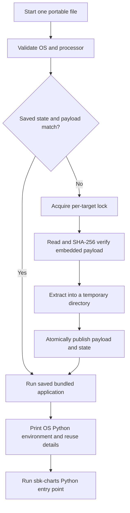
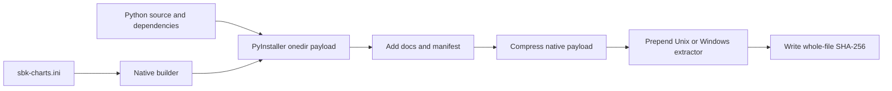

<!--
Copyright (c) KMG. All Rights Reserved.

Licensed under the Apache License, Version 2.0 (the "License");
you may not use this file except in compliance with the License.
You may obtain a copy of the License at

    http://www.apache.org/licenses/LICENSE-2.0
-->

# Self-extracting portable applications

A portable release is one native file containing sbk-charts, Python, core dependencies, and all supported AI backend dependencies. It does not need a source checkout, installed Python, pip, venv, or Conda.

The file extracts itself only when its saved payload is absent or invalid. Later executions reuse the validated saved application. This differs from the source launchers, which construct dependency profiles and may use venv or Conda.

| Delivery | Destination requirement | First execution | Later execution |
|---|---|---|---|
| Source launcher | Bash or PowerShell and network for new managed setup | Install Python and selected locked profile | Validate and reuse the saved environment |
| Self-extracting portable file | Native OS shell and standard extraction tools | Verify and extract embedded bundled runtime | Validate and reuse saved bundled runtime |
| Wheel | Compatible Python and installer | Install package and dependencies | Use installed Python environment |

## Supported files

| Target | Release file | Processor |
|---|---|---|
| Linux | `sbk-charts-<version>-linux-amd64.run` | x86-64 |
| macOS | `sbk-charts-<version>-macos-arm64.run` | Apple silicon |
| Windows | `sbk-charts-<version>-windows-amd64.exe` | x86-64 |

Portable files are built natively and are not universal. Using the wrong file stops with a target-mismatch error before extraction.

## Download and verify

Download the portable file and its adjacent `.sha256` file from the release.

Linux:

```bash
sha256sum --check sbk-charts-<version>-linux-amd64.run.sha256
```

macOS:

```bash
shasum -a 256 sbk-charts-<version>-macos-arm64.run
cat sbk-charts-<version>-macos-arm64.run.sha256
```

Compare the two macOS hash values.

Windows:

```powershell
Get-FileHash .\sbk-charts-<version>-windows-amd64.exe -Algorithm SHA256
Get-Content .\sbk-charts-<version>-windows-amd64.exe.sha256
```

The external checksum covers the complete release file. The launcher also verifies the embedded payload before extracting it. The payload contains `manifest.json`, which records the SHA-256 of every bundled file.

## Run

Linux or macOS:

```bash
chmod +x sbk-charts-<version>-<target>.run
./sbk-charts-<version>-<target>.run -i /path/to/results.csv -o report.xlsx
```

Windows PowerShell:

```powershell
.\sbk-charts-<version>-windows-amd64.exe -i C:\path\to\results.csv -o report.xlsx
```

Normal application arguments are forwarded unchanged. Cloud backends still require credentials and service access. Local backends still require their service or model resources.

## First execution and saved reuse



The default saved locations are:

| OS | Default root |
|---|---|
| Linux | `${XDG_CACHE_HOME:-$HOME/.cache}/sbk-charts/portable` |
| macOS | `$HOME/Library/Caches/sbk-charts/portable` |
| Windows | `%LOCALAPPDATA%\sbk-charts\portable` |

Set `SBK_CHARTS_PORTABLE_ROOT` before execution to use a different location. This is useful for read-only homes, shared deployment systems, tests, and cleanup.

The saved path includes application version, target, and payload checksum. Installing a new release therefore cannot overwrite an older release. A state file records schema, target, version, payload checksum, and installation path. Missing, mismatched, or damaged state triggers safe re-extraction.

Concurrent first executions use one per-target lock. The process that acquires it extracts and publishes the application. Waiting processes revalidate and reuse the published result. Failed temporary extraction directories are removed, and the application is never started while the lock is held.

Example first execution output:

```text
sbk-charts: Operating system: Linux-...
sbk-charts: Python: 3.12.x (.../sbk-charts)
sbk-charts: Environment: portable (.../sbk-charts/portable/...)
sbk-charts: Dependency profile: all-ai
sbk-charts: Selection source: self-extract-created
sbk-charts: Saved environment reused: no
sbk-charts: Environment created this run: yes
```

The second execution reports `self-extract-cache`, reuse `yes`, and creation `no`.

## Internal file format

Unix artifacts contain a POSIX shell launcher followed by a binary TAR.GZ payload. The launcher knows the exact payload line and expected SHA-256. Windows artifacts are small native .NET Framework launchers followed by a ZIP payload and its length footer. The expected payload SHA-256 is compiled into the launcher.

The Windows launcher source is [`scripts/windows_self_extractor.cs`](../scripts/windows_self_extractor.cs). The native build locates the Windows .NET Framework C# compiler, substitutes policy-derived constants into this reviewed template, compiles it, and appends the verified payload. The launcher forwards arguments with Windows command-line escaping and starts the bundled application only after releasing its named extraction mutex.

The extracted payload is a PyInstaller one-directory application. Keeping that representation inside the self-extractor avoids PyInstaller extracting its runtime into a new temporary directory on every execution.



## Build locally

Use a machine matching the target:

```bash
python -m pip install --upgrade pip
python -m pip install ".[all-ai]" -r requirements-portable.txt
python -m unittest discover -s tests -v
python scripts/build_portable.py
```

Output is written to `dist/portable/`. Select another directory with `--output`.

Linux release automation installs CPU-only Torch before building. A development environment containing CUDA Torch can create a much larger local artifact.

## Release verification

The native CI matrix performs these checks on Linux, macOS, and Windows:

1. build the frozen payload and run its help command;
2. build the single self-extracting file and checksum;
3. execute it from an empty runtime root;
4. verify first-run creation provenance;
5. execute it again and verify saved reuse provenance;
6. create an XLSX workbook from the sample CSV;
7. upload exactly the portable application and checksum.

The workflow runs for pull requests, pushes to `main`, manual requests, and releases. Release events attach the files to the GitHub release.

## Security and operational limits

- The application verifies checksums but is not currently code-signed or notarized.
- Unix execution requires a POSIX shell, `tar`, and either `sha256sum` or `shasum`.
- Windows execution requires the built-in .NET Framework 4 runtime; it does not require PowerShell for the portable application.
- Input and output paths remain external and require normal filesystem permissions.
- Provider credentials are never embedded.
- Model downloads and separately hosted local AI services are not embedded.
- Old versioned payloads remain available until the user removes their version directory.

Target names, payload formats, self-extracting extensions, runtime-state policy, runners, and bundled paths are owned by [`sbk-charts.ini`](../sbk-charts.ini). Read [POLICY.md](POLICY.md) before changing them.
