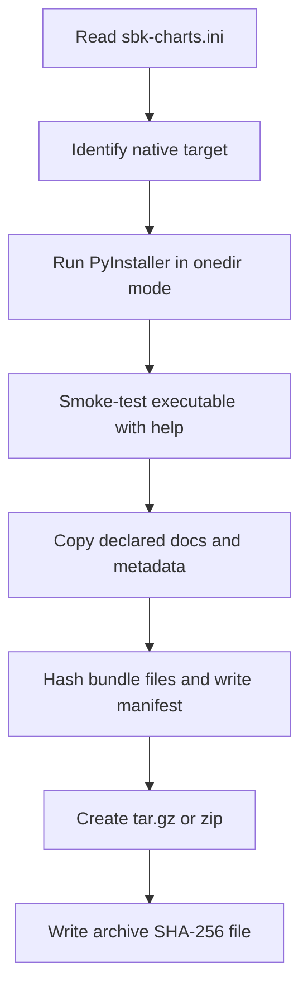

<!--
Copyright (c) KMG. All Rights Reserved.
Licensed under the Apache License, Version 2.0.
-->

# Portable sbk-charts distributions

A portable distribution is a native archive containing sbk-charts, a Python runtime, and Python dependencies. It is useful when the destination machine should not install Python, pip, venv, or Conda.

This is different from the repository launchers:

| Delivery | Python on destination | First-run package download | Best for |
|---|---|---|---|
| Source launcher | Required, or Conda must be available | Usually yes | Development and source checkouts |
| Portable archive | Not required | No for bundled application code | Fixed native deployment |
| Wheel | Required | Installation downloads dependencies as needed | Existing Python environments |

## Supported native targets

| Target | Archive | Processor |
|---|---|---|
| Linux | `sbk-charts-<version>-linux-amd64.tar.gz` | x86-64 |
| macOS | `sbk-charts-<version>-macos-arm64.tar.gz` | Apple silicon |
| Windows | `sbk-charts-<version>-windows-amd64.zip` | x86-64 |

Portable builds are not universal and are not cross-compiled. Choose the archive that exactly matches the operating system and processor.

## Download and verify

Download both the archive and its adjacent `.sha256` file from the GitHub release.

Linux:

```bash
sha256sum --check sbk-charts-<version>-linux-amd64.tar.gz.sha256
```

macOS:

```bash
shasum -a 256 sbk-charts-<version>-macos-arm64.tar.gz
cat sbk-charts-<version>-macos-arm64.tar.gz.sha256
```

Compare the two hash values on macOS.

Windows PowerShell:

```powershell
Get-FileHash .\sbk-charts-<version>-windows-amd64.zip -Algorithm SHA256
Get-Content .\sbk-charts-<version>-windows-amd64.zip.sha256
```

Checksums detect accidental or malicious file changes after publication. The project archives are not code-signed or notarized, so apply any additional organizational trust policy you require.

## Extract and run

Extract the complete top-level directory. Do not move only the executable; PyInstaller's `_internal` directory must stay beside it.

Linux or macOS:

```bash
tar -xzf sbk-charts-<version>-<target>.tar.gz
cd sbk-charts-<version>-<target>
./sbk-charts -i /path/to/results.csv -o report.xlsx
```

Windows PowerShell:

```powershell
Expand-Archive .\sbk-charts-<version>-windows-amd64.zip
Set-Location .\sbk-charts-<version>-windows-amd64\sbk-charts-<version>-windows-amd64
.\sbk-charts.exe -i C:\path\to\results.csv -o report.xlsx
```

All normal application arguments are supported, including AI backends. Cloud backends still need credentials and network access. Local-service backends still need their server and model. The in-process PyTorch backend still needs enough memory for the selected bundled/code-supported model behavior.

## Bundle contents

A bundle contains:

- the `sbk-charts` executable, with `.exe` on Windows;
- PyInstaller's `_internal` runtime directory;
- license, README, documentation, and policy files declared in `sbk-charts.ini`;
- `manifest.json` with application, version, target, archive format, hash algorithm, and hashes of bundled files.

The external `.sha256` covers the final archive. The internal manifest covers individual files inside the extracted bundle.

## Build flow



`scripts/build_portable.py` fails immediately for an unsupported operating system, processor, target, archive type, or missing declared bundle path. The help smoke test must pass before an archive is created.

## Build locally

Use a native machine matching the desired target. Start in an environment where the application dependencies can be installed.

```bash
python -m pip install --upgrade pip
python -m pip install . -r requirements-portable.txt
python -m unittest discover -s tests -v
python scripts/build_portable.py
```

Output is written to `dist/portable/` by default. A different directory can be selected:

```bash
python scripts/build_portable.py --output /tmp/sbk-portable
```

For the Linux release shape, the workflow installs the official CPU-only PyTorch wheel before installing sbk-charts. This keeps CUDA runtimes out of the Linux archive.

## Release automation

`.github/workflows/portable.yml` reads its target/runner matrix from `scripts/project_policy.py`. Each matrix job runs on its native GitHub runner, installs pinned build tools, runs portable tests, builds one archive, and uploads the archive plus checksum. On a published GitHub release, the files are attached to that release.

Action versions are pinned to full commit SHAs. Checkout credentials are not persisted.

## Validate a built archive

At minimum:

1. verify the external archive checksum;
2. list archive entries and confirm one top-level directory;
3. extract everything into a clean directory;
4. run `sbk-charts --help` from the extracted bundle;
5. create a workbook from the sample CSV;
6. open the workbook and confirm Summary and charts exist;
7. compare each file hash with `manifest.json` if performing release validation;
8. test on a clean machine or container matching the target when possible.

## Limitations and operations

- A portable archive works only on its declared native target.
- macOS Gatekeeper or Windows security controls may warn because archives are not signed.
- Input CSV and output XLSX paths remain external and writable by the user.
- Provider credentials are not bundled.
- Model downloads and local AI server setup are not eliminated by bundling the application.
- Upgrade by extracting a new version into a new directory. Do not overlay `_internal` directories from different versions.
- Keep the external checksum with any internally mirrored archive.

Target names, runners, archive formats, bundle paths, and hashing rules are owned by [`sbk-charts.ini`](../sbk-charts.ini). See [POLICY.md](POLICY.md) before changing them.
