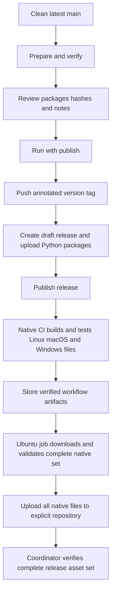

<!--
Copyright (c) KMG. All Rights Reserved.

Licensed under the Apache License, Version 2.0 (the "License");
you may not use this file except in compliance with the License.
You may obtain a copy of the License at

    http://www.apache.org/licenses/LICENSE-2.0
-->

# GitHub release guide

This guide explains how to publish a complete sbk-charts release. The release
contains Python packages, GitHub source archives, and native self-extracting
applications for every target declared in `sbk-charts.ini`.

The release coordinator is [`scripts/create_github_release.py`](../scripts/create_github_release.py).
It uses the existing native GitHub Actions workflow instead of trying to build
Windows and macOS applications on one computer.

## What the script publishes

For version `<version>`, the complete asset set is:

| Kind | Files |
|---|---|
| Python package | `sbk_charts-<version>-py3-none-any.whl` |
| Python source distribution | `sbk_charts-<version>.tar.gz` |
| Package checksums | `SHA256SUMS` |
| Linux application | `sbk-charts-<version>-linux-amd64.run` and `.sha256` |
| macOS application | `sbk-charts-<version>-macos-arm64.run` and `.sha256` |
| Windows application | `sbk-charts-<version>-windows-amd64.exe` and `.sha256` |
| Repository source | GitHub-generated ZIP and TAR.GZ archives |

The target list and native filename extensions are read from `sbk-charts.ini`.
Adding a future target to policy automatically adds it to the required release
asset set.

Only the nine uploaded files in the table are release assets for the current
three-target policy. `RELEASE_NOTES.md` is used as the GitHub release body; it
is not uploaded as a separate asset. GitHub creates the repository source ZIP
and TAR.GZ automatically from the immutable version tag.

## Repository-content audit

GitHub source archives contain every file tracked by Git at the release tag.
Before running tests or creating a tag, the coordinator audits `git ls-files`
and refuses to continue when it finds checkout-only or generated content:

- `.DS_Store`, Excel temporary files, or root `out.xls`/`out.xlsx` reports;
- Python bytecode and `__pycache__` directories;
- virtual environments, managed runtime caches, or runtime state;
- IDE state, `.env`, coverage data, package metadata, or dependency caches;
- `build`, `dist`, test-tool cache directories, or previously built packages;
- tracked `.run`, `.exe`, wheel, source-distribution, or checksum artifacts.

The normal clean-worktree check separately rejects modified, staged, deleted,
or untracked files. Together these checks ensure that a release tag exactly
matches a clean `origin/main` checkout and that GitHub-generated source archives
do not contain local checkout debris.

## Prerequisites

Use a clean checkout of the latest `main` branch. Install the development tools
described in [DEVELOPMENT.md](DEVELOPMENT.md), plus authenticated GitHub CLI:

```bash
gh auth login
gh auth status
git checkout main
git pull --ff-only origin main
```

Set the approved version once in `src/version/sbk_version.py` and merge that
change before publishing. The script rejects a different command-line version,
a dirty checkout, a non-`main` branch, or a commit that differs from
`origin/main`.

## Step 1: prepare and review

Run without `--publish` first:

```bash
venv-sbk-charts/bin/python scripts/create_github_release.py
```

Preparation performs the following work:

1. validates the canonical version, exact `origin/main` commit, clean checkout,
   and tracked source-file audit;
2. runs all unit tests and focused Flake8 checks;
3. checks Bash syntax and launcher help;
4. creates and opens a sample workbook through the source launcher;
5. builds the wheel and source distribution in an isolated temporary directory;
6. writes package hashes to `dist/release/SHA256SUMS`;
7. generates detailed notes at `dist/release/RELEASE_NOTES.md`.

Review the artifact names, hashes, commit summary, examples, and release notes.
The preparation command does not create a tag and does not change GitHub.

To supply hand-written notes while keeping all other checks:

```bash
venv-sbk-charts/bin/python scripts/create_github_release.py \
  --notes-file /path/to/reviewed-notes.md
```

The optional `--python <path>` flag selects the interpreter used for unit
tests, lint checks, and wheel/sdist builds. The `./sbk-charts` smoke test still
uses the launcher's normal runtime selection policy, so it may reuse a different
saved, managed, virtual, or Conda environment. This deliberately verifies both
the chosen development interpreter and the user-facing bootstrap path.

## Step 2: publish

After reviewing the prepared output, rerun with explicit publication approval:

```bash
venv-sbk-charts/bin/python scripts/create_github_release.py --publish
```

The script reruns verification so the published files always come from a newly
validated checkout. It then:

1. creates and pushes an annotated `<version>` tag;
2. creates a draft GitHub release and uploads the wheel, sdist, and checksums;
3. publishes the release, which starts the native portable workflow;
4. waits while the native jobs build, test, and store their files as workflow
   artifacts;
5. lets one Ubuntu publishing job download the complete native set, validate
   the policy-derived filenames and SHA-256 sidecars, and attach all native
   files to the explicit GitHub repository;
6. succeeds only when the complete policy-derived asset set is present.

The native workflow builds on Linux, macOS, and Windows. Each native job tests
concurrent first extraction, saved application reuse, help, and sample workbook
generation. Native jobs never modify a GitHub release. The Ubuntu publishing
job runs only after every native job succeeds, so no operating-system shell is
responsible for interpreting the release tag or uploading its own partial set.
Release and recovery builds explicitly check out the requested version tag;
the validator also rejects assets whose version differs from that checkout's
canonical application version.



## Recover from an interrupted publication

The script never replaces a tag that points to another commit. If the correct
tag or release was created before an interruption, inspect it on GitHub and
resume explicitly:

```bash
venv-sbk-charts/bin/python scripts/create_github_release.py \
  --publish --resume
```

Resume mode verifies the same clean commit, rebuilds and replaces only the
Python package assets, publishes a matching draft if necessary, and waits for
the complete native asset set. When an already-published release is missing a
native file, resume mode dispatches the portable workflow for the existing
immutable tag. It does not move or force-push a tag.

The recovery workflow follows the same build-to-publish handoff as a normal
release: every native target must pass, the Ubuntu job must validate the exact
downloaded set and checksums, and only then are the native assets replaced.

For an already-published release, `--resume` preserves the existing title and
release notes. Its purpose is artifact recovery, not editorial changes. If the
published notes must change, review and edit them separately with GitHub after
the artifact recovery is complete. A resumed draft still receives the reviewed
notes file when it is published.

The default native-build timeout is one hour. Slow hosted runners can use a
larger value:

```bash
venv-sbk-charts/bin/python scripts/create_github_release.py \
  --publish --resume --timeout-seconds 7200
```

## Important safety rules

- Never publish from a feature branch or an unmerged commit.
- Never reuse a version tag for different source.
- Never use `--resume` until you have inspected the existing release.
- Do not manually upload one operating system's artifact as another target.
- Do not claim a native target passed until its hosted workflow is green.
- Keep release executables, wheels, source archives, and generated notes out of Git.
- Code signing and Apple notarization are not currently part of this workflow.
